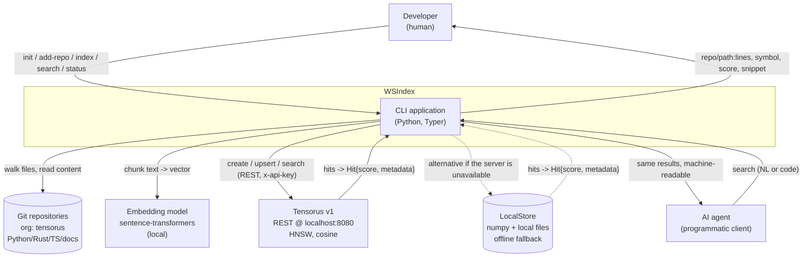
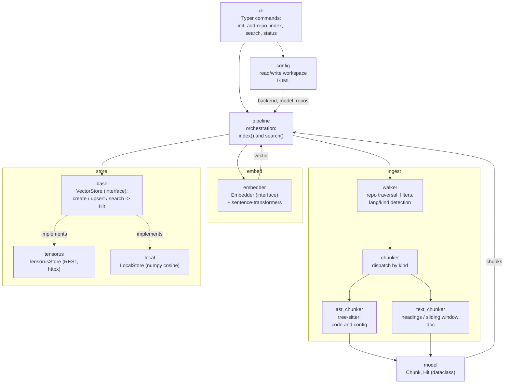
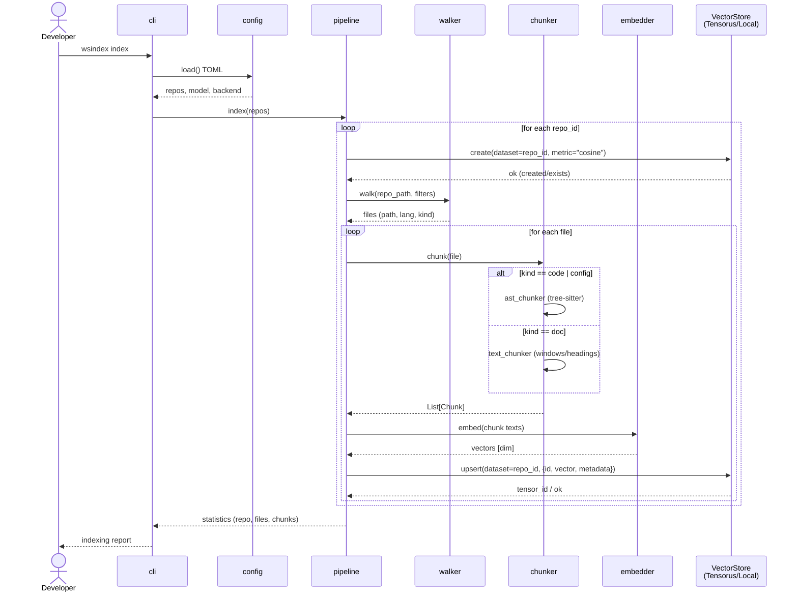
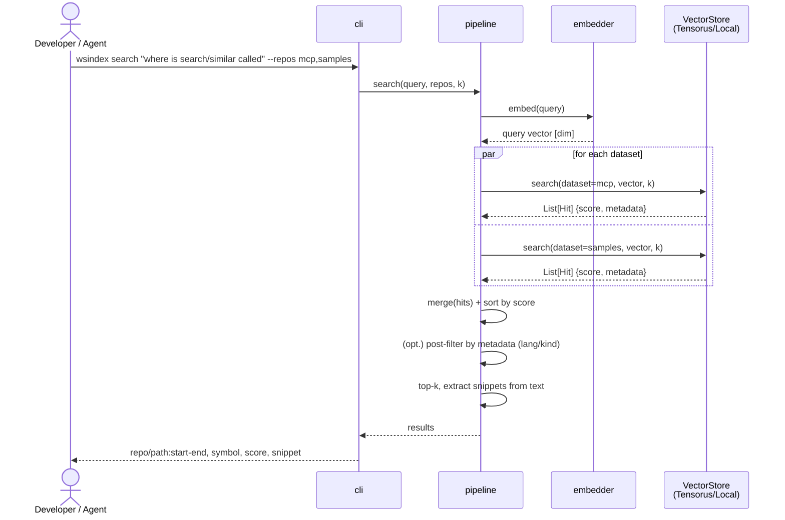

# WSIndex — Architecture Document

> Status: draft for the MVP (Phase E1). The document version is aligned with the BRD and the WSIndex Concept. All facts about Tensorus v1 and the architectural core are fixed as a single reference and must not diverge between documents.

______________________________________________________________________

## 1. Overview and Goal

**WSIndex** (Workspace Indexer, working title) is a Python CLI application that indexes a developer's workspace (in the MVP — a set of git repositories) and provides semantic search over it. A developer or an AI agent phrases a question in natural language (or as a code fragment) and gets relevant chunks from several repositories at once: code, configs, documentation. The key questions the system answers: "where has this already been done", "where is this defined", "where is this configured".

Everything runs **locally and self-hosted**: source code never leaves the machine, embeddings are computed by local models, and the index is stored in a locally hosted Tensorus v1 or in local files.

The project is deliberately two-phase in spirit. First it is an **educational project**: simple, readable, pedagogical, with a transparent linear pipeline and a minimum of "magic". Then it evolves into a product along a roadmap (E2–E5): structural metadata from the AST, incremental re-indexing via git diff, tensor re-rank (late interaction / MaxSim), a development-space graph, and moving hot paths to Rust.

**MVP scope (Phase E1):**

- Indexing several repositories into a single logical index. The initial corpus is the [github.com/tensorus](https://github.com/tensorus) organization (polyglot: Python, Rust, TypeScript), repositories: `tensorus`, `mcp`, `samples`, `datasets`, `models`, `tensorus-website`, `v1`, `v1_web`, `v1_docs`.
- Chunking by file type: code and configs — via AST (tree-sitter), documentation — as text.
- Local embeddings (sentence-transformers), with a pluggable model.
- Storage: a chunk's embedding is written as a tensor to Tensorus v1 over REST; the chunk's metadata is placed in the JSON `metadata` field. Isolation: one Tensorus dataset per repository.
- Search: the query is embedded, `search/similar` (HNSW, cosine) runs across the relevant datasets, results are merged and ranked, and the output is `repo/path:lines, symbol, score, snippet`.
- CLI commands: `init`, `add-repo`, `index` (full and incremental), `search`, `status`.

What is **out of MVP scope** (roadmap): tensor late-interaction/MaxSim, a development-space graph (issues/PRs/commits), bug trackers, distribution/sharding, an IDE plugin, cloud, and moving hot paths to Rust.

The document describes the MVP architecture so that it can be built, explained to a student, and extended phase by phase without rewriting.

______________________________________________________________________

## 2. Drivers and Quality Attributes

The project is educational, so the quality-attribute priorities are ordered differently than in typical production. This is a deliberate decision and it runs through all subsequent sections.

**Priority order (descending):**

**Understandability > Modifiability > Portability/Offline > Performance.**

| Priority | Attribute             | What it means in practice                                          | How the architecture ensures it                                                                                                   |
| -------- | --------------------- | ------------------------------------------------------------------ | --------------------------------------------------------------------------------------------------------------------------------- |
| 1        | Understandability     | A student reads the code and sees the data flow without a debugger | A single **linear pipeline** `repos -> walk -> chunk -> embed -> store`; small modules; no hidden queues or asynchrony in the MVP |
| 2        | Modifiability         | Swapping the model, backend, or chunker without rewriting the core | `Embedder`, `Chunker`, `VectorStore` interfaces; the pipeline depends on abstractions, not implementations                        |
| 3        | Portability / offline | The project runs and is tested without external services           | `LocalStore` as a fallback to `TensorusStore`; local models; TOML config; no cloud calls                                          |
| 4        | Performance           | Adequate operation on tens of thousands of chunks                  | Brute-force cosine in the fallback and HNSW in Tensorus are sufficient; optimizations are deferred to Phase E5                    |

**Drivers (what shapes the architecture):**

- **Multi-repo as the primary scenario.** One question → answers from several repositories. Hence "dataset per repository" and client-side merging of results.
- **Polyglot corpus.** Python + Rust + TypeScript + configs + Markdown. Hence tree-sitter with a set of grammars and splitting the chunkers into `ast_chunker` and `text_chunker`.
- **Locality and privacy.** Code never leaves the machine. Hence self-hosted Tensorus and local embeddings.
- **Deterministic re-indexing.** A chunk's `id` = hash of content and path → deterministic, reproducible re-indexing; the specific deduplication mechanism (recreating the dataset or skipping on `id` match) depends on the Tensorus contract — see §11.
- **Phase-based extensibility.** The architecture must accommodate structural filters, re-rank, and a graph without breaking the core.

Explicit **tactics**: encapsulation behind interfaces (modifiability), eliminating external dependencies via a fallback (portability), determinism by `id` (predictability), and capping scale at "tens of thousands of chunks" (a deliberate refusal of premature optimization).

______________________________________________________________________

## 3. System Context (C4 Level 1)

At the context level, WSIndex is a single CLI application sitting between a human/agent and three external dependencies: git repositories (the data source), the embedding model (converting text into vectors), and Tensorus v1 (vector storage and search).



**Actors:**

- **Developer** — runs CLI commands, reads the output in the terminal.
- **AI agent** — calls `search` programmatically and consumes the structured result (e.g., for an LLM's context window).

**External systems:**

- **Git repositories** — read-only: tree traversal, file reading. Git is used as a way to define the corpus (a set of working copies); in Phase E2, reading `git diff` for incrementality will be added here.
- **Embedding model** — a local sentence-transformers model; compact by default, optionally a code model for code. Replaceable via the `Embedder` interface.
- **Tensorus v1** — a self-hosted tensor database with a REST API and HNSW search. The primary index store.
- **LocalStore** — not an "external system" but a built-in offline alternative on numpy; shown in the context to emphasize that it works without a running Rust server.

**Response normalization.** Both `TensorusStore` and `LocalStore` normalize their native response (`tensor_id` for Tensorus, `id` for Local) into the unified `Hit{score, metadata}` type (see §4 and §6.4) — that is why both arrows in the diagram are labeled `Hit`.

______________________________________________________________________

## 4. Components (C4 Level 3)

The C4 container level (L2) is trivial in the MVP — it is a single Python CLI process (`wsindex`), alongside which an external Tensorus server runs as a separate container; so we go straight from the context (§3) to the components.

The internal structure of the `wsindex` package follows the linear pipeline. Each component is a separate module/subpackage with a narrow responsibility.

**The "pipeline step → module" correspondence.** The pipeline step names `repos -> walk -> chunk -> embed -> store` and the `wsindex` module names are the same nodes at different levels of description: `walk`→`walker`; `chunk`→`chunker` (dispatcher) + `ast_chunker`/`text_chunker`; `embed`→`embedder`; `store`→the `store` package (`VectorStore` + implementations). They are used interchangeably in the rest of the document.



**Component responsibilities:**

- **cli** — a thin layer on Typer (Click under the hood). Parses arguments, calls `config` and `pipeline`, formats output. No business logic.
- **config** — loading and writing the workspace config in TOML: the list of repositories (`repo_id` + path), the selected backend (`tensorus`/`local`), the embedding model name, dimensionality, the Tensorus base URL, and chunking parameters.
- **pipeline** — the orchestrator of the two scenarios. `index()` runs `walk -> chunk -> embed -> store.upsert(dataset=repo)`; `search()` runs `embed(query) -> for each dataset store.search(dataset, k) -> merge(Hit) -> format`. The only place where the components connect and where the merging and final ranking of multi-repo results happen.
- **ingest.walker** — walks the repo's working copy, applies filters (ignoring `.git`, binaries, oversized files, `node_modules`, `target`, `__pycache__`), and determines the language (`lang`) and type (`kind` ∈ {code, config, doc}) by file extension/name.
- **ingest.chunker** — dispatcher: by `kind` it selects `ast_chunker` (code/config) or `text_chunker` (doc). Returns a list of `Chunk` objects.
- **ingest.ast_chunker** — splits via tree-sitter. For code — functions/classes/methods/blocks; for configs (TOML/YAML/JSON/Dockerfile) — by structural nodes (tables/keys/sections/stages). Fills in `symbol`, `node_type`, `start_line`, `end_line`.
- **ingest.text_chunker** — splits documentation (Markdown/txt/rst, text cells of notebooks) by headings or with an overlapping sliding window.
- **embed.embedder** — the `Embedder` interface + a sentence-transformers implementation (`encode(texts) -> vectors`). Batching, normalization.
- **store.base** — the `VectorStore` interface with the methods `create(dataset)`, `upsert(dataset, items)`, `search(dataset, vector, k) -> List[Hit]`. Search runs over a **single** dataset; merging results from several datasets is the `pipeline`'s concern, not the store's (Tensorus also searches within a single dataset). The `Hit` type is a unified, backend-independent search result `{score, metadata}` (plus an optional native id); both implementations normalize their native response (Tensorus — `tensor_id`, Local — `id`) into `Hit`, so the `pipeline` reads chunk fields from `metadata` rather than from a specific store's id.
- **store.tensorus** — `TensorusStore`: a REST client to Tensorus v1 built on httpx.
- **store.local** — `LocalStore`: brute-force cosine on numpy, stored in local files.
- **model** — `Chunk` (dataclass/pydantic) — the unit of the index, the shared data contract between `ingest`, `embed`, `store`; `Hit` also lives here — the unified search-result type (see §6.4).

The direction of dependencies is strictly top-down: `cli -> pipeline -> {ingest, embed, store}`, and all three depend on `model`. The `pipeline` works only with the `Embedder` and `VectorStore` interfaces; `config` injects the concrete implementations.

______________________________________________________________________

## 5. Key Scenarios

### 5.1 "Indexing" scenario (`wsindex index`)

A full index pass goes through every repository in the config. For each file: chunking → embedding → upsert into the repository's dataset. `id = hash(text + path)` makes re-indexing **deterministic**: the same chunk always yields the same `id`.

How determinism turns into **deduplication** depends on Tensorus's capabilities, and this is an open integration question (see §7.2 and §11):

- either a full re-index starts by recreating the repository's dataset — this requires a dataset/tensor deletion endpoint, which the documented v1 contract does not have;
- or `upsert` can write by the `id` key (upsert-by-id), which the current `POST /tensors` (create only) does not guarantee.

In the MVP we rely on deterministic `id`s and treat deduplication as a *Should*-priority requirement, to be confirmed once the Tensorus contract is clarified.



Example: indexing the `tensorus/mcp` repository. The walker finds `server.py` (kind=code, lang=python), `ast_chunker` splits it into functions/classes, each chunk is embedded and written as a `shape=[dim]` tensor into the `mcp` dataset with `metadata` where `path="server.py"`, `symbol="search_similar"`, `node_type="function_definition"`, `start_line`/`end_line`.

**Incremental indexing** (`index --incremental`): in the MVP — skipping chunks whose `id` is already present in the dataset (*Should* priority; assumes the ability to check for an `id`'s presence — see the assumption in §11); in Phase E2 — re-indexing only changed files via `git diff`. Thus, **the MVP increment = skipping on `id` match, while the git-diff increment = Phase E2**.

### 5.2 "Search" scenario (`wsindex search`)

The query is embedded with the same `Embedder` as the corpus, then `search/similar` runs across the selected datasets, and the results are merged, sorted by score, and formatted.



Example output:

```
mcp/server.py:88-104   search_similar   0.83   client.post(f"/datasets/{ds}/search/similar", ...)
samples/quickstart.py:12-30  main       0.79   resp = requests.post(base + "/search/similar", ...)
```

The same query vector is used across all datasets, so scores are comparable (a single cosine metric on all datasets). Merging and final ranking happen on the client (`pipeline`) because each `search` call hits a single dataset (and Tensorus searches within a single dataset).

______________________________________________________________________

## 6. Data Model

### 6.1 Chunk

`Chunk` — the unit of the index and the shared contract between layers. Implemented as a dataclass (or a pydantic model for validation).

| Field        | Type          | Purpose                                                    | Example (from the tensorus corpus)             |
| ------------ | ------------- | ---------------------------------------------------------- | ---------------------------------------------- |
| `id`         | `str`         | Hash of `content + path`; primary key, ensures determinism | `"a3f9c1e2…"` (sha256 of the text and path)    |
| `repo`       | `str`         | Repository identifier (`repo_id`)                          | `"mcp"`                                        |
| `path`       | `str`         | File path relative to the repo root                        | `"server.py"`                                  |
| `lang`       | `str`         | File language/format                                       | `"python"`, `"rust"`, `"typescript"`, `"toml"` |
| `kind`       | `str`         | Category: `code` \| `config` \| `doc`                      | `"code"`                                       |
| `symbol`     | `str \| None` | Symbol name for code                                       | `"search_similar"`                             |
| `node_type`  | `str \| None` | AST node type (tree-sitter)                                | `"function_definition"`, `"table"` (TOML)      |
| `start_line` | `int`         | Start line (1-based)                                       | `88`                                           |
| `end_line`   | `int`         | End line                                                   | `104`                                          |
| `text`       | `str`         | The chunk's source text (for embedding and snippet)        | `"def search_similar(...): ..."`               |

For `doc` chunks, `symbol` and `node_type` may be `None` (or carry the section heading). The embedding is **not** stored in `Chunk` — it is computed on the fly and sent to the `VectorStore`; this keeps `Chunk` a pure description of the fragment.

### 6.2 Dataset-per-repository

Source isolation is implemented via **one Tensorus dataset per repository**: `repo_id` = the dataset name. This provides natural isolation (re-indexing/deleting a repo = operations on a single dataset), transparent client-side merging of multi-repo results, and works around the property-search limitation. The full rationale and consequences of this decision are canonically in **ADR-5** (§8), and the technical implication is in §7.4; here only the "repository → dataset" mapping itself matters.

All datasets are created with a single `cosine` metric so that scores are comparable when merged.

### 6.3 Mapping Chunk → tensor + metadata

The exact correspondence during `upsert` into Tensorus:

| Chunk part                                                                  | Where it goes in Tensorus     | Format                                         |
| --------------------------------------------------------------------------- | ----------------------------- | ---------------------------------------------- |
| `embed(text)` — vector                                                      | the tensor's `data`           | a flat row-major Float32 array of length `dim` |
| model dimensionality                                                        | the tensor's `shape`          | `[dim]`, e.g. `[384]`                          |
| `id, repo, path, lang, kind, symbol, node_type, start_line, end_line, text` | the tensor's `metadata` field | a JSON object                                  |
| `repo`                                                                      | the dataset name `{ds}`       | `repo_id`                                      |

Schematically, the body of `POST /datasets/{repo}/tensors` (the `data` array holds exactly `dim` Float32 values, the first two are shown here):

```json
{
  "data": [0.0123, -0.0456, ...],
  "shape": [384],
  "metadata": {
    "id": "a3f9c1e2…",
    "repo": "mcp",
    "path": "server.py",
    "lang": "python",
    "kind": "code",
    "symbol": "search_similar",
    "node_type": "function_definition",
    "start_line": 88,
    "end_line": 104,
    "text": "def search_similar(...): ..."
  }
}
```

The Tensorus response is `{tensor_id, descriptor}`. On search we **assume** that `metadata` is returned directly in the hit; from it the `pipeline` builds the output line `repo/path:start-end, symbol, score, snippet`. The reference contract guarantees only `(tensor_id, score, …)` in the hit, so the fallback is an extra tensor request by `tensor_id` (see the assumption in §11). This way the chunk's full context lives next to the vector, and no reverse lookup to the files is needed for formatting.

**The "whether to store `text` in `metadata`" trade-off (single source on the topic).** `text` need not be stored in full; it can be re-read from the file during formatting — this is a choice between index size and independence from files. In the MVP we store `text` in metadata for simplicity and offline operation. In §11 this trade-off is only mentioned as a size risk and refers back here.

### 6.4 Hit — the search result

`Hit` — the unified type that `VectorStore.search` returns regardless of the backend:

| Field       | Type          | Purpose                                                                                       |
| ----------- | ------------- | --------------------------------------------------------------------------------------------- |
| `score`     | `float`       | Similarity score (cosine), comparable across datasets                                         |
| `metadata`  | `dict`        | The chunk's full `metadata` (all `Chunk` fields); the `pipeline` builds output from it        |
| `native_id` | `str \| None` | The backend's native identifier (`tensor_id` for Tensorus, `id` for Local); an internal field |

`TensorusStore` and `LocalStore` normalize their native responses into `Hit`, so the `pipeline` does not know which store the result came from and reads chunk fields only from `metadata`. If Tensorus does not return `metadata` directly in the hit, `TensorusStore` additionally requests the tensor by `native_id` and augments the `Hit` (see §11).

______________________________________________________________________

## 7. Integration with Tensorus v1 and the Offline Alternative

### 7.1 General REST rules

- Transport: REST, base URL `http://localhost:8080`, `Content-Type: application/json`.
- All numeric values are **Float32**. A tensor is encoded as a flat row-major `data` array plus a `shape` with the dimensions. For an embedding this is `shape=[dim]`.
- The client is httpx inside `TensorusStore`.

### 7.2 Endpoints used by WSIndex

| Method + path                        | Request body                            | Response                               | Role in WSIndex                                                                             |
| ------------------------------------ | --------------------------------------- | -------------------------------------- | ------------------------------------------------------------------------------------------- |
| `POST /datasets`                     | `{name, metric:"cosine"}`               | ok (idempotent)                        | Create the repository's dataset. The metric is fixed per dataset: `cosine` \| `l2` \| `dot` |
| `POST /datasets/{ds}/tensors`        | `{data:[…], shape:[dim], metadata:{…}}` | `{tensor_id, descriptor}`              | Write the chunk's embedding + its metadata                                                  |
| `POST /datasets/{ds}/search/similar` | `{vector:[…], k}`                       | a list of hits `(tensor_id, score, …)` | k-NN search via HNSW                                                                        |

Additional Tensorus endpoints that are **not** used in the MVP but matter for growth:

- `POST /datasets/{ds}/search/property` — a filter by the tensor's **mathematical** properties (norm, rank, symmetry), **not** by our `metadata`.
- `POST /datasets/{ds}/search/contraction` — structural/tensor search (useful for re-rank in Phase E3).

**Open question — deletion/overwrite.** The documented v1 contract contains only create operations (`POST /datasets`, `POST /tensors`); it has no dataset/tensor deletion endpoint (`DELETE /datasets/{ds}` or upsert-by-id). Therefore the mechanism for duplicate-free full re-indexing (recreating the dataset) is not guaranteed by the contract in the MVP — we record this as an open integration question (see §5.1 and §11).

### 7.3 Auth

Single-key mode: the `x-api-key` header with a value from the `TENSORUS_API_KEY` environment variable. In dev mode auth may be disabled — then the header is not required. `TensorusStore` reads the key from the environment and adds the header to all requests if it is set.

### 7.4 An important consequence: property-search and the choice of isolation

The key integration fact: **property-search filters by the tensor's mathematical properties (norm, rank, symmetry), not by arbitrary `metadata`**. This means you cannot use a single server-side filter to tell Tensorus "return only chunks with `lang=rust` from repository `v1`".

Hence two architectural decisions, canonically described in **ADR-5** (§8):

1. **isolation by repository — via "dataset per repository"**: selecting the relevant datasets for `search/similar` replaces a server-side filter by `repo`;
1. **filtering by the other fields (`lang`, `kind`) — with a client-side post-filter** by `metadata` in the `pipeline` after the hits are received.

This is a deliberate trade-off: the server provides fast k-NN, and we do fine-grained filtering on the client. At the scale of "tens of thousands of chunks" this is sufficient.

### 7.5 LocalStore — the offline alternative

`LocalStore` implements the same `VectorStore` interface but entirely on numpy:

- `create(dataset)` — creates the dataset's local "folder/file".
- `upsert(dataset, items)` — appends vectors (a `float32` matrix) and `metadata` (JSON) to local files; the key is the chunk's `id`.
- `search(dataset, vector, k)` — brute-force cosine over a **single** dataset: we normalize the vectors, compute dot products, take top-k, and return `List[Hit]` (`{score, metadata}`). The cosine metric is the same as in Tensorus, so switching the backend does not change score semantics. Iterating over several datasets and merging results happens in the `pipeline`, exactly as for Tensorus.

Its purpose is to make the project **work without a running Rust server**: important for learning (out-of-the-box startup), for tests (pytest without external services), and for offline portability. The backend choice is a config parameter (`backend = "tensorus"` | `"local"`). Both backends are interchangeable behind the `VectorStore` interface, and the `pipeline` does not know about the concrete implementation.

______________________________________________________________________

## 8. Key Architectural Decisions (ADRs)

### ADR-1. tree-sitter for AST chunking

- **Context.** The corpus is polyglot (Python, Rust, TypeScript, as well as TOML/YAML/JSON/Dockerfile configs). Line/regex splitting loses function boundaries and config structure, degrading relevance and snippets.
- **Decision.** Use tree-sitter with a set of grammars (python, rust, typescript, toml, yaml, json, dockerfile, markdown). For code, split by functions/classes/methods/blocks; for configs, by structural nodes (tables/keys/sections/stages). Fill `symbol`, `node_type`, `start_line`, `end_line` from the AST.
- **Consequences.** (+) Meaningful chunk boundaries, ready ground for structural filters in Phase E2. (+) A single mechanism for many languages. (−) Dependence on the grammars and their build; (−) an unsupported language needs a fallback to text splitting. Documentation (Markdown/txt/rst) is not split via AST — it goes to `text_chunker`.

### ADR-2. Tensorus v1 as the index DB + LocalStore fallback

- **Context.** A self-hosted vector store with k-NN is needed. Tensorus v1 is the project's target DB (including as an educational demonstration of Tensorus itself). But requiring a running Rust server for every run is a barrier for learning and tests.
- **Decision.** The primary backend is `TensorusStore` (REST to v1, HNSW, cosine). Plus `LocalStore` (numpy brute-force cosine, local files) as an offline fallback. The backend is chosen in the config.
- **Consequences.** (+) The project runs and is tested without external services; (+) a real production path through Tensorus. (−) Two implementations must be kept at semantic parity (both cosine, the same contract, the unified `Hit` type). (−) LocalStore does not scale, but that is not its job.
- **Superseded by ADR-7** (`docs/adr/adr-007-post-mvp-storage.md`, 2026-08-19): the premises above died — see ADR-7's Context.

### ADR-3. Single-vector in the MVP, tensor re-rank deferred

- **Context.** "Tensor" retrieval (late interaction / MaxSim) is the conceptual core of the project's growth, but it is harder to implement and explain.
- **Decision.** In the MVP — **single-vector**: one vector per chunk, search via `search/similar`. Tensor re-rank / late interaction (MaxSim) is not in the MVP but in the roadmap (Phase E3).
- **Consequences.** (+) A simple, understandable, and fast baseline; (+) directly compatible with Tensorus's HNSW. (−) A lower relevance ceiling than late interaction. (+) The data model and store are already ready to accept re-rank on top of top-k without breaking the core.

### ADR-4. The VectorStore abstraction

- **Context.** At least two stores are needed (Tensorus and local), and in the future — a graph and possibly other DBs. Modifiability is the priority.
- **Decision.** Introduce the `VectorStore` interface (`create`, `upsert`, `search(dataset, vector, k) -> List[Hit]`) in `store/base`. Implementations: `TensorusStore`, `LocalStore`. The `pipeline` depends only on the interface and the `Hit` type, not on the backends' native responses.
- **Consequences.** (+) Switching the backend is a config matter; (+) tests run on LocalStore; (+) an extension point for new stores. (−) A small abstraction overhead — justified by the modifiability priority. `Embedder` and `Chunker` are introduced symmetrically.

### ADR-5. Dataset-per-repository for isolation

- **Context.** Tensorus's property-search does not filter by arbitrary `metadata`, yet isolation and deletion by repository are mandatory (multi-repo is the primary scenario).
- **Decision.** One Tensorus dataset per repository, `repo_id` = the dataset name. Multi-repo search = selecting a set of datasets and merging on the client; fine-grained filtering (`lang`, `kind`) — with a client-side post-filter.
- **Consequences.** (+) Natural isolation, simple deletion/re-indexing of a repo; (+) works around the property-search limitation. (−) Merging and final ranking of results fall on the client (`pipeline`), but with a single cosine metric the scores are comparable.
- **Canonicity.** This is the only source of the rationale for the "dataset-per-repo" scheme; §6.2 and §7.4 refer here.

### ADR-6. TOML config and Typer CLI

- **Context.** A readable workspace config and a convenient, self-documenting CLI are needed. The priorities are understandability and a low barrier to entry.
- **Decision.** The workspace config in **TOML** (repositories, backend, model, dim, Tensorus URL, chunking parameters). A CLI on **Typer** (Click under the hood): `init`, `add-repo`, `index`, `search`, `status`.
- **Consequences.** (+) TOML is familiar to the Python ecosystem and to the corpus itself (`pyproject.toml`, Rust configs); (+) Typer provides typed arguments and auto-help almost for free. (−) TOML is less flexible for deeply nested structures — sufficient for the MVP.

### ADR-7. Post-MVP storage: LanceDB for vectors

Supersedes ADR-2. Full text: `docs/adr/adr-007-post-mvp-storage.md` —
starting with ADR-7, ADRs live as separate files under `docs/adr/`;
this section keeps short pointers only.

______________________________________________________________________

## 9. Tech Stack and Directory Structure

**Technology stack:**

| Layer            | Technologies                                                                             |
| ---------------- | ---------------------------------------------------------------------------------------- |
| Language/runtime | Python 3.11+                                                                             |
| CLI              | Typer (Click under the hood)                                                             |
| Chunking         | tree-sitter + grammars: python, rust, typescript, toml, yaml, json, dockerfile, markdown |
| Embeddings       | sentence-transformers (+ torch); pluggable model                                         |
| HTTP client      | httpx (Tensorus client)                                                                  |
| Data models      | dataclasses / pydantic                                                                   |
| Tests            | pytest                                                                                   |
| Installation     | pip                                                                                      |
| Config           | TOML (workspace)                                                                         |

**Structure of the `wsindex/` package:**

```
wsindex/
├── __init__.py
├── cli.py                  # Typer: init, add-repo, index, search, status
├── config.py               # read/write workspace TOML
├── pipeline.py             # orchestration of index() and search()
├── model.py                # dataclass Chunk, Hit
├── ingest/
│   ├── __init__.py
│   ├── walker.py           # repo traversal, filters, lang/kind detection
│   ├── chunker.py          # dispatch by kind
│   ├── ast_chunker.py      # tree-sitter: code + config
│   └── text_chunker.py     # headings / sliding window: doc
├── embed/
│   ├── __init__.py
│   └── embedder.py         # Embedder interface + sentence-transformers
├── store/
│   ├── __init__.py
│   ├── base.py             # VectorStore interface (create/upsert/search -> Hit)
│   ├── tensorus.py         # TensorusStore (REST, httpx)
│   └── local.py            # LocalStore (numpy cosine, local files)
└── py.typed

tests/
├── test_walker.py
├── test_ast_chunker.py
├── test_text_chunker.py
├── test_local_store.py     # offline, without Tensorus
├── test_pipeline_index.py
└── test_pipeline_search.py

pyproject.toml              # dependencies, entry point wsindex = wsindex.cli:app
README.md
```

The directory tree mirrors the component diagram (§4) one-to-one: the `ingest`, `embed`, `store` packages correspond to the component groups, and `pipeline`, `config`, `model`, `cli` to the top-level modules. An example workspace config (`wsindex.toml`) created by `init`/`add-repo`:

```toml
[workspace]
name = "tensorus-org"
backend = "tensorus"          # or "local"

[embeddings]
model = "sentence-transformers/all-MiniLM-L6-v2"
dim = 384

[tensorus]
base_url = "http://localhost:8080"
metric = "cosine"

[[repos]]
id = "mcp"
path = "~/src/tensorus/mcp"

[[repos]]
id = "v1"
path = "~/src/tensorus/v1"
```

______________________________________________________________________

## 10. Evolution: How Phases E2–E5 Change the Components

The MVP architecture is laid out so that each phase adds capabilities through existing extension points rather than rewriting the core.

**Phase E2 — structural metadata and incrementality.**

- Affects `ingest/ast_chunker.py`: additional features are extracted from the AST — `node_type` (already present), `pub`/`async` modifiers, decorators, visibility. They are placed in `metadata`.
- `pipeline.search()` gains client-side filters by these fields (e.g., "only `async` functions", "only `pub` in the Rust repo `v1`").
- `walker` + a new pass over `git diff`: incremental re-indexing of only the changed files. Deterministic `id`s are already in place for this (see §5.1).
- The store does not change.

**Phase E3 — tensor re-rank (late interaction / MaxSim).**

- A new `Reranker` component appears (e.g., `rerank/`), which recomputes relevance via late-interaction on top of the top-k from `VectorStore.search`. Two paths: a custom MaxSim on the chunk's multi-vector representation **or** using Tensorus's `/search/contraction`.
- `model.Chunk` gains a multi-vector representation if needed; `store` gains an extended upsert for several vectors per chunk.
- `pipeline.search()` gains an optional `rerank(hits)` step. ADR-3 explicitly leaves room for this.

**Phase E4 — development space (graph).**

- New sources: docs/ADRs/issues/PRs/commits. `walker` is extended/new source readers.
- A `GraphStore` appears (a symbolic graph of cross-repo links) alongside `VectorStore`. The target growth scenario: "where the tensorus API is called and what breaks when the signature changes" — links `mcp`/`samples` → `tensorus`.
- The `pipeline` learns to combine vector search and graph traversal.

**Phase E5 — performance and scale.**

- Profiling reveals hot paths (walk, chunk, embed batching). Moving the critical sections to Rust (e.g., as an extension or service).
- `TensorusStore` may move to batch endpoints/a connection pool; `LocalStore` — to an ANN index instead of brute-force.
- The `VectorStore`/`Embedder`/`Chunker` interfaces remain stable — the implementations change.

In summary:

| Phase | Main changes                          | Affected components                          |
| ----- | ------------------------------------- | -------------------------------------------- |
| E2    | Structural filters, incrementality    | `ast_chunker`, `walker`, `pipeline.search`   |
| E3    | Tensor re-rank (MaxSim / contraction) | new `Reranker`, `model`, `store`, `pipeline` |
| E4    | Development-space graph               | new sources, `GraphStore`, `pipeline`        |
| E5    | Performance, Rust                     | `store`/`embed` implementations, hot paths   |

______________________________________________________________________

## 11. Risks and Assumptions

**Assumptions:**

- Repositories are available as local working copies; git is used to define the corpus (and `git diff` in Phase E2), not for network operations in the MVP.
- With `backend="tensorus"`, Tensorus v1 is running locally at `http://localhost:8080` with a fixed REST contract (endpoints and formats in §7). In its absence, `LocalStore` is used.
- **Duplicate-free re-indexing** assumes Tensorus has a mechanism for dataset deletion/recreation or upsert-by-id; the documented v1 contract has no such endpoint (see §7.2). In the MVP we rely on deterministic `id`s (skipping on `id` match, *Should* priority); the final mechanism is an open question requiring confirmation of the Tensorus contract (see §5.1).
- **Returning `metadata` in the hit.** By the reference contract, `search/similar` guarantees only the fields `(tensor_id, score, …)`. We assume that `metadata` is returned directly in the hit; if not, `TensorusStore` makes an additional tensor request by `tensor_id` (`GET`) and augments the `Hit` with the `metadata` field. The `Hit` type (§6.4) isolates this fallback from the `pipeline` (see §6.3).
- One embedding model per index: the corpus and queries are embedded with the same model with a single `dim`. Changing the model requires re-indexing.
- Scale — tens of thousands of chunks. Millions are already a product, outside the current NFRs.
- The metric on all datasets is `cosine`, which makes scores comparable during multi-repo merging.

**Risks and mitigation:**

| Risk                                                            | Consequence                                            | Mitigation                                                                                                       |
| --------------------------------------------------------------- | ------------------------------------------------------ | ---------------------------------------------------------------------------------------------------------------- |
| Incompatible tree-sitter grammars or an unsupported language    | Chunking fails/degrades                                | Fallback to text splitting (`text_chunker`) for unknown `lang`; pin grammar versions                             |
| Change of the Tensorus v1 REST contract                         | `TensorusStore` breaks                                 | Encapsulation behind `VectorStore`; integration tests; `LocalStore` as insurance                                 |
| The v1 contract has no deletion/upsert-by-id                    | A full re-index may spawn duplicate tensors            | Deterministic `id`s; recreate the dataset once a DELETE endpoint appears; open integration question (§5.1, §7.2) |
| `search/similar` does not return `metadata` in the hit          | The output line cannot be built from a single response | An extra `GET` of the tensor by `tensor_id`; the `Hit` type isolates this from the `pipeline` (§6.3, §6.4)       |
| property-search does not filter by `metadata`                   | Cannot filter by `lang`/`kind` server-side             | Dataset-per-repository (ADR-5) + client-side post-filter                                                         |
| Model/dimensionality drift between indexing and search          | Incomparable/broken vectors                            | Store `model` and `dim` in the config; check on `search`; require re-indexing on mismatch                        |
| Single-vector relevance ceiling                                 | Some relevant chunks do not surface                    | Deliberate MVP trade-off; re-rank in Phase E3 (ADR-3)                                                            |
| Index size due to `text` in `metadata`                          | Growth of storage volume                               | Option not to store `text` but re-read from the file; the trade-off is documented in §6.3                        |
| Heavy dependencies (torch) complicate the "educational startup" | The barrier to entry rises                             | `LocalStore` without Tensorus; a compact default model; a documented `pip` installation path                     |
| Large/binary files in the repo                                  | Slowdown and junk                                      | `walker` filters (size, binariness, ignoring `target`/`node_modules`/`__pycache__`/`.git`)                       |

Bottom line: the MVP architecture is a minimal but complete vertical slice "repositories → search", built on a linear pipeline and three key interfaces (`Chunker`, `Embedder`, `VectorStore`) with a unified result type `Hit`. It meets the educational priorities (understandability > modifiability > portability > performance) and leaves pre-marked growth points for phases E2–E5 without requiring a rewrite of the core.
