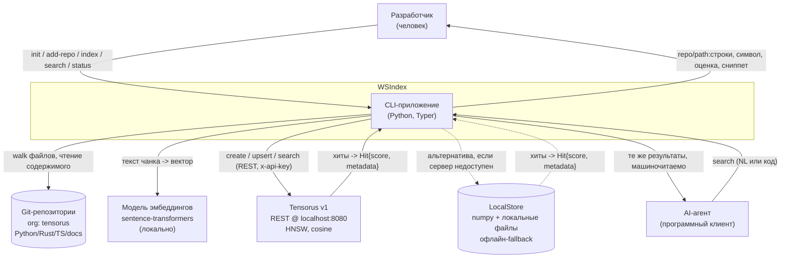
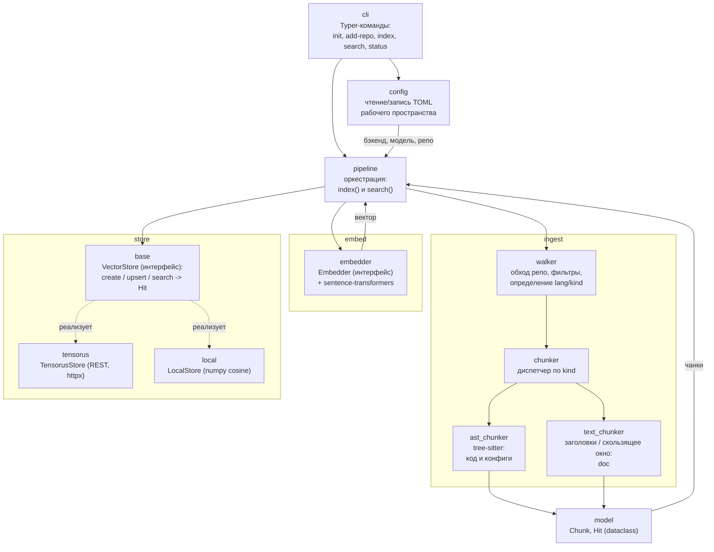
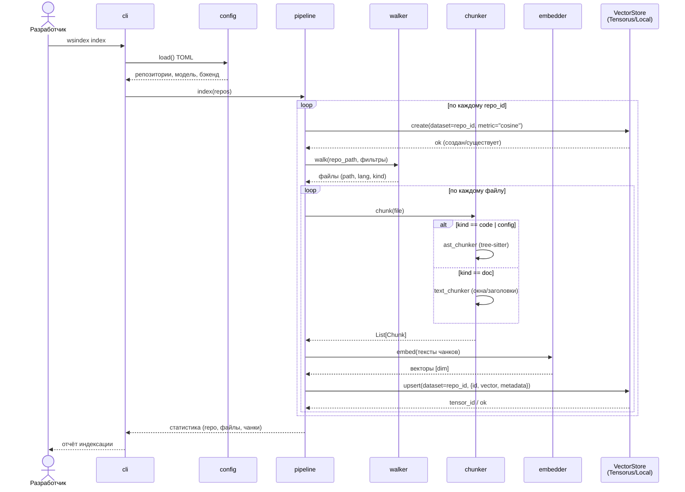
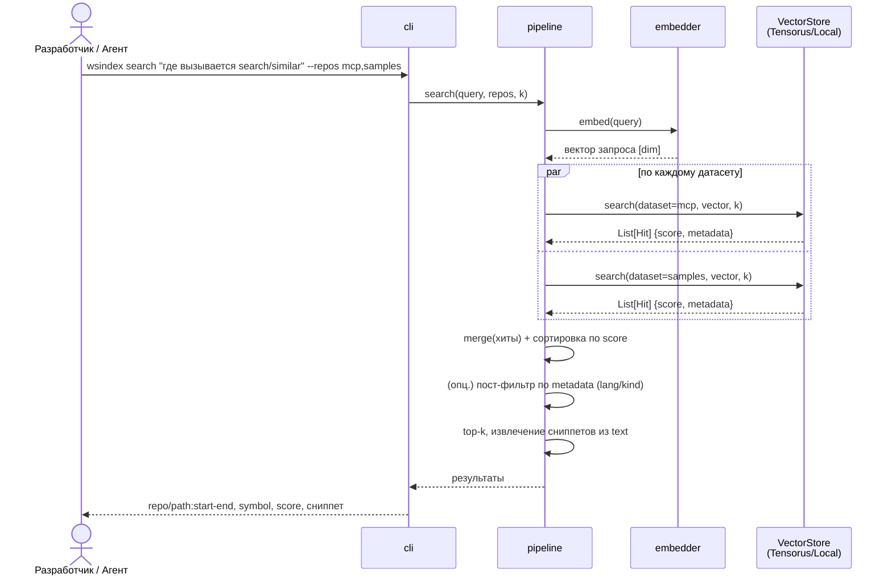

# WSIndex — Архитектурный документ

> Статус: черновик для MVP (Э1). Версия документа согласована с BRD и Концептом WSIndex. Все факты о Tensorus v1 и архитектурном ядре зафиксированы как единый эталон и не должны расходиться между документами.

> **Раздел о хранилище устарел — сознательно и только здесь.** Документ
> описывает Tensorus v1 как индексную БД и `LocalStore` как запасной
> вариант. Ни того, ни другого больше нет: **ADR-7**
> (`docs/adr/adr-007-post-mvp-storage.md`, 2026-08-19) заменил их
> встроенным LanceDB, код снесён 21.08.2026. §8 это фиксирует, §§1–7
> вокруг этого ещё не переписаны — каждое упоминание Tensorus ниже
> читать как историю. Что проект хранит сегодня — в README.

______________________________________________________________________

## 1. Обзор и цель

**WSIndex** (Workspace Indexer, рабочее название) — это CLI-приложение на Python, которое индексирует рабочее пространство разработчика (в MVP — множество git-репозиториев) и даёт по нему семантический поиск. Разработчик или AI-агент формулирует вопрос на естественном языке (или фрагментом кода) и получает релевантные куски сразу из нескольких репозиториев: код, конфиги, документацию. Ключевые вопросы, на которые отвечает система: «где это уже сделано», «где определено», «где настраивается».

Всё работает **локально и self-hosted**: исходный код не покидает машину, эмбеддинги считаются локальными моделями, индекс хранится в локально поднятом Tensorus v1 либо в локальных файлах.

Проект сознательно двухфазный по духу. Сначала это **учебный проект**: простой, читаемый, педагогичный, с прозрачным линейным конвейером и минимумом «магии». Затем он эволюционирует в продукт по дорожной карте (Э2–Э5): структурные метаданные из AST, инкрементальная переиндексация по git-diff, тензорный re-rank (late interaction / MaxSim), граф пространства разработки, перенос горячих путей в Rust.

**Область MVP (Э1):**

- Индексация нескольких репозиториев в один логический индекс. Стартовый корпус — организация [github.com/tensorus](https://github.com/tensorus) (полиглот: Python, Rust, TypeScript), репозитории: `tensorus`, `mcp`, `samples`, `datasets`, `models`, `tensorus-website`, `v1`, `v1_web`, `v1_docs`.
- Chunking по типам файлов: код и конфиги — через AST (tree-sitter), документация — как текст.
- Локальные эмбеддинги (sentence-transformers), модель подключаемая.
- Хранение: эмбеддинг чанка пишется тензором в Tensorus v1 по REST; метаданные чанка кладутся в JSON-поле `metadata`. Изоляция — один датасет Tensorus на репозиторий.
- Поиск: запрос эмбеддится, идёт `search/similar` (HNSW, cosine) по нужным датасетам, результаты объединяются и ранжируются, на выходе — `repo/path:строки, символ, оценка, сниппет`.
- CLI-команды: `init`, `add-repo`, `index` (полная и инкрементальная), `search`, `status`.

Что **вне MVP** (дорожная карта): тензорный late-interaction/MaxSim, граф пространства разработки (issues/PR/commits), баг-трекеры, распределённость/шардирование, IDE-плагин, облако, перенос горячих путей в Rust.

Документ описывает архитектуру MVP так, чтобы её можно было построить, объяснить студенту и без переписывания расширять по фазам.

______________________________________________________________________

## 2. Драйверы и атрибуты качества

Проект учебный, поэтому приоритеты атрибутов качества выстроены иначе, чем в типичном продакшене. Это осознанное решение и оно пронизывает все последующие разделы.

**Порядок приоритетов (по убыванию):**

**Понятность (Understandability) > Модифицируемость (Modifiability) > Переносимость/офлайн (Portability/Offline) > Производительность (Performance).**

| Приоритет | Атрибут                | Что означает на практике                               | Как обеспечивается в архитектуре                                                                                                             |
| --------- | ---------------------- | ------------------------------------------------------ | -------------------------------------------------------------------------------------------------------------------------------------------- |
| 1         | Понятность             | Студент читает код и видит поток данных без отладчика  | Единый **линейный конвейер** `repos -> walk -> chunk -> embed -> store`; маленькие модули; отсутствие скрытых очередей и асинхронности в MVP |
| 2         | Модифицируемость       | Замена модели, бэкенда, чанкера без переписывания ядра | Интерфейсы `Embedder`, `Chunker`, `VectorStore`; конвейер зависит от абстракций, а не от реализаций                                          |
| 3         | Переносимость / офлайн | Проект запускается и тестируется без внешних сервисов  | `LocalStore` как fallback к `TensorusStore`; локальные модели; конфиг в TOML; никаких облачных вызовов                                       |
| 4         | Производительность     | Адекватная работа на десятках тысяч чанков             | Достаточно brute-force cosine в fallback и HNSW в Tensorus; оптимизации отложены до Э5                                                       |

**Драйверы (что формирует архитектуру):**

- **Мульти-репо как первичный сценарий.** Один вопрос → ответы из нескольких репозиториев. Отсюда «датасет на репозиторий» и объединение результатов на клиенте.
- **Полиглот-корпус.** Python + Rust + TypeScript + конфиги + Markdown. Отсюда tree-sitter с набором грамматик и разделение чанкеров на `ast_chunker` и `text_chunker`.
- **Локальность и приватность.** Код не покидает машину. Отсюда self-hosted Tensorus и локальные эмбеддинги.
- **Детерминированная переиндексация.** `id` чанка = хеш содержимого и пути → детерминированная, воспроизводимая переиндексация; конкретный механизм бездубликатности (пересоздание датасета либо пропуск по совпадению `id`) зависит от контракта Tensorus — см. §11.
- **Расширяемость по фазам.** Архитектура должна принимать структурные фильтры, re-rank и граф без ломки ядра.

Явные **тактики**: инкапсуляция за интерфейсами (модифицируемость), устранение внешних зависимостей через fallback (переносимость), детерминизм по `id` (предсказуемость), ограничение масштаба «десятки тысяч чанков» (сознательный отказ от преждевременной оптимизации).

______________________________________________________________________

## 3. Контекст системы (C4 уровень 1)

На контекстном уровне WSIndex — это одно CLI-приложение между человеком/агентом и тремя внешними зависимостями: git-репозиториями (источник данных), моделью эмбеддингов (преобразование текста в векторы) и Tensorus v1 (хранилище и поиск по векторам).



**Актёры:**

- **Разработчик** — запускает команды CLI, читает выдачу в терминале.
- **AI-агент** — вызывает `search` программно и потребляет структурированный результат (например, для контекстного окна LLM).

**Внешние системы:**

- **Git-репозитории** — только читаются: обход дерева, чтение файлов. Git используется как способ определить корпус (набор рабочих копий); в Э2 сюда добавится чтение `git diff` для инкрементальности.
- **Модель эмбеддингов** — локальная модель sentence-transformers; по умолчанию компактная, для кода опционально код-модель. Заменяема через интерфейс `Embedder`.
- **Tensorus v1** — self-hosted БД тензоров с REST API и HNSW-поиском. Основное хранилище индекса.
- **LocalStore** — не «внешняя система», а встроенная офлайн-альтернатива на numpy; показана в контексте, чтобы подчеркнуть работоспособность без поднятого Rust-сервера.

**Нормализация ответа.** И `TensorusStore`, и `LocalStore` приводят свой нативный ответ (`tensor_id` у Tensorus, `id` у Local) к единому типу `Hit{score, metadata}` (см. §4 и §6.4) — поэтому на диаграмме обе стрелки помечены `Hit`.

______________________________________________________________________

## 4. Компоненты (C4 уровень 3)

Уровень контейнеров C4 (L2) в MVP тривиален — это один CLI-процесс на Python (`wsindex`), рядом с которым как отдельный контейнер работает внешний Tensorus-сервер; поэтому от контекста (§3) сразу переходим к компонентам.

Внутренняя структура пакета `wsindex` следует линейному конвейеру. Каждый компонент — отдельный модуль/подпакет с узкой ответственностью.

**Соответствие «шаг конвейера → модуль».** Имена шагов конвейера `repos -> walk -> chunk -> embed -> store` и имена модулей `wsindex` — это одни и те же узлы на разных уровнях описания: `walk`→`walker`; `chunk`→`chunker` (диспетчер) + `ast_chunker`/`text_chunker`; `embed`→`embedder`; `store`→пакет `store` (`VectorStore` + реализации). Дальше в документе они используются как синонимы.



**Ответственности компонентов:**

- **cli** — тонкий слой на Typer (Click под капотом). Разбирает аргументы, вызывает `config` и `pipeline`, форматирует вывод. Никакой бизнес-логики.
- **config** — загрузка и запись конфига рабочего пространства в TOML: список репозиториев (`repo_id` + путь), выбранный бэкенд (`tensorus`/`local`), имя модели эмбеддингов, размерность, base URL Tensorus, параметры чанкинга.
- **pipeline** — оркестратор двух сценариев. `index()` гоняет `walk -> chunk -> embed -> store.upsert(dataset=repo)`; `search()` гоняет `embed(query) -> для каждого датасета store.search(dataset, k) -> merge(Hit) -> формат`. Единственное место, где компоненты соединяются и где происходит объединение и финальное ранжирование мульти-репо результатов.
- **ingest.walker** — обходит рабочую копию репо, применяет фильтры (игнор `.git`, бинарников, слишком больших файлов, `node_modules`, `target`, `__pycache__`), определяет язык (`lang`) и тип (`kind` ∈ {code, config, doc}) по расширению/имени файла.
- **ingest.chunker** — диспетчер: по `kind` выбирает `ast_chunker` (code/config) или `text_chunker` (doc). Возвращает список объектов `Chunk`.
- **ingest.ast_chunker** — режет через tree-sitter. Для кода — функции/классы/методы/блоки; для конфигов (TOML/YAML/JSON/Dockerfile) — по структурным узлам (таблицы/ключи/секции/стадии). Заполняет `symbol`, `node_type`, `start_line`, `end_line`.
- **ingest.text_chunker** — режет документацию (Markdown/txt/rst, текстовые ячейки ноутбуков) по заголовкам либо скользящим окном с перекрытием.
- **embed.embedder** — интерфейс `Embedder` + реализация на sentence-transformers (`encode(texts) -> vectors`). Батчинг, нормализация.
- **store.base** — интерфейс `VectorStore` с методами `create(dataset)`, `upsert(dataset, items)`, `search(dataset, vector, k) -> List[Hit]`. Поиск идёт по **одному** датасету; объединение результатов нескольких датасетов — забота `pipeline`, а не стора (Tensorus тоже ищет внутри одного датасета). Тип `Hit` — единый, не зависящий от бэкенда результат поиска `{score, metadata}` (плюс опционально нативный id); обе реализации нормализуют свой нативный ответ (Tensorus — `tensor_id`, Local — `id`) в `Hit`, поэтому `pipeline` читает поля чанка из `metadata`, а не из id конкретного стора.
- **store.tensorus** — `TensorusStore`: REST-клиент к Tensorus v1 на httpx.
- **store.local** — `LocalStore`: brute-force cosine на numpy, хранение в локальных файлах.
- **model** — `Chunk` (dataclass/pydantic) — единица индекса, общий контракт данных между `ingest`, `embed`, `store`; здесь же живёт `Hit` — единый тип результата поиска (см. §6.4).

Направление зависимостей строго сверху вниз: `cli -> pipeline -> {ingest, embed, store}`, и все три зависят от `model`. `pipeline` работает только с интерфейсами `Embedder` и `VectorStore`, конкретные реализации подставляет `config`.

______________________________________________________________________

## 5. Ключевые сценарии

### 5.1 Сценарий «Индексация» (`wsindex index`)

Полная индексация проходит по всем репозиториям конфига. Для каждого файла: чанкинг → эмбеддинг → upsert в датасет репозитория. `id = hash(text + path)` делает переиндексацию **детерминированной**: один и тот же чанк всегда даёт один и тот же `id`.

Как детерминизм превращается в **бездубликатность**, зависит от возможностей Tensorus, и это открытый вопрос интеграции (см. §7.2 и §11):

- либо полная переиндексация начинается с пересоздания датасета репозитория — для этого нужен эндпоинт удаления датасета/тензоров, которого в задокументированном контракте v1 нет;
- либо `upsert` умеет писать по ключу `id` (upsert-by-id), чего текущий `POST /tensors` (только создание) не гарантирует.

В MVP мы полагаемся на детерминированные `id` и трактуем дедупликацию как требование приоритета *Should*, подтверждаемое при уточнении контракта Tensorus.



Пример: индексация репозитория `tensorus/mcp`. Walker находит `server.py` (kind=code, lang=python), `ast_chunker` режет его на функции/классы, каждый чанк эмбеддится и пишется тензором `shape=[dim]` в датасет `mcp` с `metadata`, где `path="server.py"`, `symbol="search_similar"`, `node_type="function_definition"`, `start_line`/`end_line`.

**Инкрементальная индексация** (`index --incremental`): в MVP — пропуск чанков, чей `id` уже присутствует в датасете (приоритет *Should*; предполагает возможность проверить наличие `id` — см. допущение в §11); в Э2 — переиндексация только изменённых файлов по `git diff`. Таким образом, **MVP-инкремент = пропуск по совпадению `id`, а git-diff-инкремент = Э2**.

### 5.2 Сценарий «Поиск» (`wsindex search`)

Запрос эмбеддится тем же `Embedder`, что и корпус, затем идёт `search/similar` по выбранным датасетам, результаты объединяются, сортируются по score и форматируются.



Пример вывода:

```
mcp/server.py:88-104   search_similar   0.83   client.post(f"/datasets/{ds}/search/similar", ...)
samples/quickstart.py:12-30  main       0.79   resp = requests.post(base + "/search/similar", ...)
```

Тот же вектор запроса используется по всем датасетам, поэтому scores сопоставимы (единая метрика cosine на всех датасетах). Объединение и финальное ранжирование — на клиенте (`pipeline`), потому что каждый вызов `search` бьёт в один датасет (и Tensorus ищет внутри одного датасета).

______________________________________________________________________

## 6. Модель данных

### 6.1 Chunk

`Chunk` — единица индекса и общий контракт между слоями. Реализуется как dataclass (или pydantic-модель для валидации).

| Поле         | Тип           | Назначение                                                     | Пример (из корпуса tensorus)                   |
| ------------ | ------------- | -------------------------------------------------------------- | ---------------------------------------------- |
| `id`         | `str`         | Хеш `content + path`; первичный ключ, обеспечивает детерминизм | `"a3f9c1e2…"` (sha256 от текста и пути)        |
| `repo`       | `str`         | Идентификатор репозитория (`repo_id`)                          | `"mcp"`                                        |
| `path`       | `str`         | Путь файла относительно корня репо                             | `"server.py"`                                  |
| `lang`       | `str`         | Язык/формат файла                                              | `"python"`, `"rust"`, `"typescript"`, `"toml"` |
| `kind`       | `str`         | Категория: `code` \| `config` \| `doc`                         | `"code"`                                       |
| `symbol`     | `str \| None` | Имя символа для кода                                           | `"search_similar"`                             |
| `node_type`  | `str \| None` | Тип AST-узла (tree-sitter)                                     | `"function_definition"`, `"table"` (TOML)      |
| `start_line` | `int`         | Начальная строка (1-based)                                     | `88`                                           |
| `end_line`   | `int`         | Конечная строка                                                | `104`                                          |
| `text`       | `str`         | Исходный текст чанка (для эмбеддинга и сниппета)               | `"def search_similar(...): ..."`               |

Для `doc`-чанков `symbol` и `node_type` могут быть `None` (или нести заголовок секции). Эмбеддинг **не** хранится в `Chunk` — он вычисляется на лету и уходит в `VectorStore`; так `Chunk` остаётся чистым описанием фрагмента.

### 6.2 Датасет-на-репозиторий

Изоляция источников реализована через **один датасет Tensorus на репозиторий**: `repo_id` = имя датасета. Это даёт естественную изоляцию (переиндексация/удаление репо = операции над одним датасетом), прозрачное объединение мульти-репо результатов на клиенте и обходит ограничение property-search. Полное обоснование и последствия этого решения — канонично в **ADR-5** (§8), техническое следствие — в §7.4; здесь важен лишь сам маппинг «репозиторий → датасет».

Все датасеты создаются с одной метрикой `cosine`, чтобы scores были сопоставимы при объединении.

### 6.3 Маппинг Chunk → тензор + metadata

Точное соответствие при `upsert` в Tensorus:

| Часть Chunk                                                                 | Куда идёт в Tensorus    | Формат                                       |
| --------------------------------------------------------------------------- | ----------------------- | -------------------------------------------- |
| `embed(text)` — вектор                                                      | `data` тензора          | плоский row-major массив Float32 длины `dim` |
| размерность модели                                                          | `shape` тензора         | `[dim]`, например `[384]`                    |
| `id, repo, path, lang, kind, symbol, node_type, start_line, end_line, text` | поле `metadata` тензора | JSON-объект                                  |
| `repo`                                                                      | имя датасета `{ds}`     | `repo_id`                                    |

Схематично тело `POST /datasets/{repo}/tensors` (в массиве `data` — ровно `dim` значений Float32, здесь показаны первые два):

```json
{
  "data": [0.0123, -0.0456, ...],
  "shape": [384],
  "metadata": {
    "id": "a3f9c1e2…",
    "repo": "mcp",
    "path": "server.py",
    "lang": "python",
    "kind": "code",
    "symbol": "search_similar",
    "node_type": "function_definition",
    "start_line": 88,
    "end_line": 104,
    "text": "def search_similar(...): ..."
  }
}
```

Ответ Tensorus — `{tensor_id, descriptor}`. При поиске мы **предполагаем**, что `metadata` возвращается прямо в хите; из неё `pipeline` строит строку вывода `repo/path:start-end, symbol, score, сниппет`. Эталонный контракт гарантирует в хите лишь `(tensor_id, score, …)`, поэтому фолбэк — доп. запрос тензора по `tensor_id` (см. допущение в §11). Так весь контекст чанка живёт рядом с вектором, и обратный запрос к файлам для форматирования не нужен.

**Компромисс «хранить ли `text` в `metadata`» (единый источник по теме).** `text` можно и не хранить целиком, а перечитывать из файла при форматировании — это выбор между размером индекса и независимостью от файлов. В MVP храним `text` в metadata ради простоты и офлайн-работы. В §11 этот компромисс лишь упомянут как риск объёма и ссылается сюда.

### 6.4 Hit — результат поиска

`Hit` — единый тип, который `VectorStore.search` возвращает независимо от бэкенда:

| Поле        | Тип           | Назначение                                                                            |
| ----------- | ------------- | ------------------------------------------------------------------------------------- |
| `score`     | `float`       | Оценка близости (cosine), сопоставима между датасетами                                |
| `metadata`  | `dict`        | Полный `metadata` чанка (все поля `Chunk`); из него `pipeline` строит вывод           |
| `native_id` | `str \| None` | Нативный идентификатор бэкенда (`tensor_id` у Tensorus, `id` у Local); служебное поле |

`TensorusStore` и `LocalStore` нормализуют свои нативные ответы в `Hit`, поэтому `pipeline` не знает, из какого стора пришёл результат, и читает поля чанка только из `metadata`. Если Tensorus не вернёт `metadata` прямо в хите, `TensorusStore` дозапрашивает тензор по `native_id` и дополняет `Hit` (см. §11).

______________________________________________________________________

## 7. Интеграция с Tensorus v1 и офлайн-альтернатива

### 7.1 Общие правила REST

- Транспорт: REST, base URL `http://localhost:8080`, `Content-Type: application/json`.
- Все числовые значения — **Float32**. Тензор кодируется как плоский row-major массив `data` плюс `shape` с размерностями. Для эмбеддинга это `shape=[dim]`.
- Клиент — httpx внутри `TensorusStore`.

### 7.2 Эндпоинты, используемые WSIndex

| Метод + путь                         | Тело запроса                            | Ответ                                | Роль в WSIndex                                                                         |
| ------------------------------------ | --------------------------------------- | ------------------------------------ | -------------------------------------------------------------------------------------- |
| `POST /datasets`                     | `{name, metric:"cosine"}`               | ok (идемпотентно)                    | Создать датасет репозитория. Метрика фиксируется на датасет: `cosine` \| `l2` \| `dot` |
| `POST /datasets/{ds}/tensors`        | `{data:[…], shape:[dim], metadata:{…}}` | `{tensor_id, descriptor}`            | Записать эмбеддинг чанка + его metadata                                                |
| `POST /datasets/{ds}/search/similar` | `{vector:[…], k}`                       | список хитов `(tensor_id, score, …)` | k-NN поиск через HNSW                                                                  |

Дополнительные эндпоинты Tensorus, которые **не** используются в MVP, но важны для роста:

- `POST /datasets/{ds}/search/property` — фильтр по **математическим** свойствам тензора (норма, ранг, симметричность), **не** по нашим `metadata`.
- `POST /datasets/{ds}/search/contraction` — структурный/тензорный поиск (пригодится для re-rank в Э3).

**Открытый вопрос — удаление/перезапись.** Задокументированный контракт v1 содержит только операции создания (`POST /datasets`, `POST /tensors`); эндпоинта удаления датасета/тензора (`DELETE /datasets/{ds}` или upsert-by-id) в нём нет. Поэтому механизм бездубликатной полной переиндексации (пересоздание датасета) в MVP не гарантирован контрактом — фиксируем это как открытый вопрос интеграции (см. §5.1 и §11).

### 7.3 Auth

Режим single-key: заголовок `x-api-key` со значением из переменной окружения `TENSORUS_API_KEY`. В dev-режиме auth может быть выключен — тогда заголовок не требуется. `TensorusStore` читает ключ из окружения и добавляет заголовок ко всем запросам, если он задан.

### 7.4 Важное следствие: property-search и выбор изоляции

Ключевой факт интеграции: **property-search фильтрует по математическим свойствам тензора (норма, ранг, симметричность), а не по произвольным `metadata`**. Значит, нельзя одним серверным фильтром сказать Tensorus «верни только чанки с `lang=rust` из репозитория `v1`».

Отсюда — два архитектурных решения, канонично описанные в **ADR-5** (§8):

1. **изоляция по репозиторию — через «датасет на репозиторий»**: выбор нужных датасетов для `search/similar` заменяет серверный фильтр по `repo`;
1. **фильтрация по прочим полям (`lang`, `kind`) — клиентским пост-фильтром** по `metadata` в `pipeline` после получения хитов.

Это осознанный компромисс: сервер даёт быстрый k-NN, тонкую фильтрацию делаем на клиенте. На масштабе «десятки тысяч чанков» этого достаточно.

### 7.5 LocalStore — офлайн-альтернатива

`LocalStore` реализует тот же интерфейс `VectorStore`, но целиком на numpy:

- `create(dataset)` — создаёт локальную «папку/файл» датасета.
- `upsert(dataset, items)` — дописывает векторы (матрица `float32`) и `metadata` (JSON) в локальные файлы; ключ — `id` чанка.
- `search(dataset, vector, k)` — brute-force cosine по **одному** датасету: нормализуем векторы, считаем скалярные произведения, берём top-k, возвращаем `List[Hit]` (`{score, metadata}`). Метрика cosine — та же, что у Tensorus, поэтому переключение бэкенда не меняет семантику score. Итерация по нескольким датасетам и объединение результатов — в `pipeline`, ровно как для Tensorus.

Назначение — чтобы проект **работал без поднятого Rust-сервера**: важно для учёбы (запуск «из коробки»), для тестов (pytest без внешних сервисов) и для офлайн-переносимости. Выбор бэкенда — параметр конфига (`backend = "tensorus"` | `"local"`). Оба бэкенда взаимозаменяемы за интерфейсом `VectorStore`, и `pipeline` о конкретной реализации не знает.

______________________________________________________________________

## 8. Ключевые архитектурные решения (ADR)

### ADR-1. tree-sitter для AST-chunking

- **Контекст.** Корпус полиглотный (Python, Rust, TypeScript, а также конфиги TOML/YAML/JSON/Dockerfile). Нарезка по строкам/regex теряет границы функций и структуру конфигов, ухудшая релевантность и сниппеты.
- **Решение.** Использовать tree-sitter с набором грамматик (python, rust, typescript, toml, yaml, json, dockerfile, markdown). Для кода резать по функциям/классам/методам/блокам; для конфигов — по структурным узлам (таблицы/ключи/секции/стадии). Из AST заполнять `symbol`, `node_type`, `start_line`, `end_line`.
- **Последствия.** (+) Осмысленные границы чанков, готовая почва для структурных фильтров в Э2. (+) Единый механизм на много языков. (−) Зависимость от грамматик и их сборки; (−) для неподдержанного языка нужен фолбэк на текстовую нарезку. Документация (Markdown/txt/rst) через AST не режется — идёт в `text_chunker`.

### ADR-2. Tensorus v1 как БД индекса + LocalStore fallback

- **Контекст.** Нужен self-hosted векторный store с k-NN. Tensorus v1 — целевая БД проекта (в т.ч. как учебная демонстрация самого Tensorus). Но требовать поднятый Rust-сервер для любого запуска — барьер для учёбы и тестов.
- **Решение.** Основной бэкенд — `TensorusStore` (REST к v1, HNSW, cosine). Плюс `LocalStore` (numpy brute-force cosine, локальные файлы) как офлайн-fallback. Бэкенд выбирается в конфиге.
- **Последствия.** (+) Проект запускается и тестируется без внешних сервисов; (+) реальный продовый путь через Tensorus. (−) Нужно поддерживать две реализации в паритете по семантике (обе cosine, одинаковый контракт, единый тип `Hit`). (−) LocalStore не масштабируется, но это и не его задача.
- **Заменён ADR-7** (`docs/adr/adr-007-post-mvp-storage.md`, 2026-08-19): предпосылки выше умерли — см. Context ADR-7.

### ADR-3. Single-vector в MVP, тензорный re-rank отложен

- **Контекст.** «Тензорный» ретрив (late interaction / MaxSim) — идейное ядро роста проекта, но он сложнее в реализации и объяснении.
- **Решение.** В MVP — **single-vector**: один вектор на чанк, поиск через `search/similar`. Тензорный re-rank / late interaction (MaxSim) — не в MVP, а в дорожной карте (Э3).
- **Последствия.** (+) Простая, понятная и быстрая базовая линия; (+) совместимо с HNSW Tensorus напрямую. (−) Ниже потолок релевантности, чем у late interaction. (+) Модель данных и store уже готовы принять re-rank поверх top-k без ломки ядра.

### ADR-4. Абстракция VectorStore

- **Контекст.** Нужны как минимум два хранилища (Tensorus и локальное), а в будущем — граф и, возможно, другие БД. Приоритет модифицируемости.
- **Решение.** Ввести интерфейс `VectorStore` (`create`, `upsert`, `search(dataset, vector, k) -> List[Hit]`) в `store/base`. Реализации: `TensorusStore`, `LocalStore`. `pipeline` зависит только от интерфейса и от типа `Hit`, а не от нативных ответов бэкендов.
- **Последствия.** (+) Смена бэкенда — вопрос конфига; (+) тесты гоняются на LocalStore; (+) точка расширения для новых хранилищ. (−) Небольшой оверхед абстракции — оправдан приоритетом модифицируемости. Симметрично вводятся `Embedder` и `Chunker`.

### ADR-5. Датасет-на-репозиторий для изоляции

- **Контекст.** property-search Tensorus не фильтрует по произвольным `metadata`, а изоляция и удаление по репозиторию нужны обязательно (мульти-репо — первичный сценарий).
- **Решение.** Один датасет Tensorus на репозиторий, `repo_id` = имя датасета. Мульти-репо поиск = выбор набора датасетов и объединение на клиенте; тонкая фильтрация (`lang`, `kind`) — клиентским пост-фильтром.
- **Последствия.** (+) Естественная изоляция, простое удаление/переиндексация репо; (+) обходит ограничение property-search. (−) Объединение и финальное ранжирование результатов ложится на клиент (`pipeline`), но при единой метрике cosine scores сопоставимы.
- **Каноничность.** Это единственный источник обоснования схемы «датасет-на-репо»; §6.2 и §7.4 ссылаются сюда.

### ADR-6. TOML-конфиг и Typer CLI

- **Контекст.** Нужен читаемый конфиг рабочего пространства и удобный, самодокументируемый CLI. Приоритеты — понятность и низкий порог входа.
- **Решение.** Конфиг рабочего пространства в **TOML** (репозитории, бэкенд, модель, dim, URL Tensorus, параметры чанкинга). CLI на **Typer** (Click под капотом): `init`, `add-repo`, `index`, `search`, `status`.
- **Последствия.** (+) TOML привычен экосистеме Python и самому корпусу (`pyproject.toml`, конфиги Rust); (+) Typer даёт типизированные аргументы и автосправку почти бесплатно. (−) TOML менее гибок для глубоко вложенных структур — для MVP достаточно.

### ADR-7. Хранилище пост-MVP: LanceDB для векторов

Заменяет ADR-2. Полный текст: `docs/adr/adr-007-post-mvp-storage.md`
(по-английски) — начиная с ADR-7, решения живут отдельными файлами в
`docs/adr/`; здесь остаются только короткие указатели.

______________________________________________________________________

## 9. Тех-стек и структура каталогов

**Технологический стек:**

| Слой          | Технологии                                                                                 |
| ------------- | ------------------------------------------------------------------------------------------ |
| Язык/рантайм  | Python 3.11+                                                                               |
| CLI           | Typer (Click под капотом)                                                                  |
| Chunking      | tree-sitter + грамматики: python, rust, typescript, toml, yaml, json, dockerfile, markdown |
| Эмбеддинги    | sentence-transformers (+ torch); модель подключаемая                                       |
| HTTP-клиент   | httpx (клиент Tensorus)                                                                    |
| Модели данных | dataclasses / pydantic                                                                     |
| Тесты         | pytest                                                                                     |
| Установка     | pip                                                                                        |
| Конфиг        | TOML (рабочее пространство)                                                                |

**Структура пакета `wsindex/`:**

```
wsindex/
├── __init__.py
├── cli.py                  # Typer: init, add-repo, index, search, status
├── config.py               # чтение/запись TOML рабочего пространства
├── pipeline.py             # оркестрация index() и search()
├── model.py                # dataclass Chunk, Hit
├── ingest/
│   ├── __init__.py
│   ├── walker.py           # обход репо, фильтры, определение lang/kind
│   ├── chunker.py          # диспетчер по kind
│   ├── ast_chunker.py      # tree-sitter: code + config
│   └── text_chunker.py     # заголовки / скользящее окно: doc
├── embed/
│   ├── __init__.py
│   └── embedder.py         # интерфейс Embedder + sentence-transformers
├── store/
│   ├── __init__.py
│   ├── base.py             # интерфейс VectorStore (create/upsert/search -> Hit)
│   ├── tensorus.py         # TensorusStore (REST, httpx)
│   └── local.py            # LocalStore (numpy cosine, локальные файлы)
└── py.typed

tests/
├── test_walker.py
├── test_ast_chunker.py
├── test_text_chunker.py
├── test_local_store.py     # офлайн, без Tensorus
├── test_pipeline_index.py
└── test_pipeline_search.py

pyproject.toml              # зависимости, entry point wsindex = wsindex.cli:app
README.md
```

Дерево каталогов один-в-один повторяет компонентную схему (§4): пакеты `ingest`, `embed`, `store` соответствуют группам компонентов, а `pipeline`, `config`, `model`, `cli` — верхнеуровневым модулям. Пример конфига рабочего пространства (`wsindex.toml`), создаваемого `init`/`add-repo`:

```toml
[workspace]
name = "tensorus-org"
backend = "tensorus"          # или "local"

[embeddings]
model = "sentence-transformers/all-MiniLM-L6-v2"
dim = 384

[tensorus]
base_url = "http://localhost:8080"
metric = "cosine"

[[repos]]
id = "mcp"
path = "~/src/tensorus/mcp"

[[repos]]
id = "v1"
path = "~/src/tensorus/v1"
```

______________________________________________________________________

## 10. Эволюция: как фазы Э2–Э5 меняют компоненты

Архитектура MVP заложена так, чтобы каждая фаза добавляла возможности через существующие точки расширения, а не переписывала ядро.

**Э2 — структурные метаданные и инкрементальность.**

- Затрагивает `ingest/ast_chunker.py`: из AST извлекаются дополнительные признаки — `node_type` (уже есть), модификаторы `pub`/`async`, декораторы, видимость. Они кладутся в `metadata`.
- `pipeline.search()` получает клиентские фильтры по этим полям (например, «только `async` функции», «только `pub` в Rust репо `v1`»).
- `walker` + новый ход по `git diff`: инкрементальная переиндексация только изменённых файлов. Детерминированные `id` для этого уже готовы (см. §5.1).
- Store не меняется.

**Э3 — тензорный re-rank (late interaction / MaxSim).**

- Появляется новый компонент `Reranker` (например, `rerank/`), который поверх top-k от `VectorStore.search` пересчитывает релевантность по late-interaction. Два пути: собственный MaxSim на многовекторном представлении чанка **либо** использование `/search/contraction` Tensorus.
- `model.Chunk` при необходимости получает многовекторное представление; `store` — расширенный upsert для нескольких векторов на чанк.
- `pipeline.search()` получает опциональный шаг `rerank(hits)`. ADR-3 явно оставляет для этого место.

**Э4 — пространство разработки (граф).**

- Новые источники: доки/ADR/issue/PR/commits. Расширяется `walker`/новые ридеры источников.
- Появляется `GraphStore` (символьный граф кросс-репо связей) рядом с `VectorStore`. Целевой сценарий роста: «где вызывается API tensorus и что сломается при смене сигнатуры» — связывает `mcp`/`samples` → `tensorus`.
- `pipeline` учится комбинировать векторный поиск и обход графа.

**Э5 — производительность и масштаб.**

- Профилирование выявляет горячие пути (walk, chunk, embed-батчинг). Перенос критичных участков в Rust (например, как расширение или сервис).
- `TensorusStore` может перейти на батч-эндпоинты/пул соединений; `LocalStore` — на ANN-индекс вместо brute-force.
- Интерфейсы `VectorStore`/`Embedder`/`Chunker` остаются стабильными — меняются реализации.

Сводно:

| Фаза | Главные изменения                        | Затронутые компоненты                          |
| ---- | ---------------------------------------- | ---------------------------------------------- |
| Э2   | Структурные фильтры, инкрементальность   | `ast_chunker`, `walker`, `pipeline.search`     |
| Э3   | Тензорный re-rank (MaxSim / contraction) | новый `Reranker`, `model`, `store`, `pipeline` |
| Э4   | Граф пространства разработки             | новые источники, `GraphStore`, `pipeline`      |
| Э5   | Производительность, Rust                 | реализации `store`/`embed`, hot paths          |

______________________________________________________________________

## 11. Риски и допущения

**Допущения:**

- Репозитории доступны как локальные рабочие копии; git используется для определения корпуса (и `git diff` в Э2), не для сетевых операций в MVP.
- Tensorus v1 при `backend="tensorus"` поднят локально на `http://localhost:8080` с фиксированным контрактом REST (эндпоинты и форматы §7). При его отсутствии работает `LocalStore`.
- **Бездубликатность переиндексации** предполагает наличие в Tensorus механизма удаления/пересоздания датасета либо upsert-by-id; в задокументированном контракте v1 такого эндпоинта нет (см. §7.2). В MVP полагаемся на детерминированные `id` (пропуск по совпадению `id`, приоритет *Should*); окончательный механизм — открытый вопрос, требующий подтверждения контракта Tensorus (см. §5.1).
- **Возврат `metadata` в хите.** `search/similar` по эталонному контракту гарантирует лишь поля `(tensor_id, score, …)`. Мы предполагаем, что `metadata` возвращается прямо в хите; если это не так, `TensorusStore` делает дополнительный запрос тензора по `tensor_id` (`GET`) и дополняет `Hit` полем `metadata`. Тип `Hit` (§6.4) изолирует этот фолбэк от `pipeline` (см. §6.3).
- Одна модель эмбеддингов на индекс: корпус и запросы эмбеддятся одной и той же моделью с одной `dim`. Смена модели требует переиндексации.
- Масштаб — десятки тысяч чанков. Миллионы — это уже продукт, вне текущих НФТ.
- Метрика на всех датасетах — `cosine`, что делает scores сопоставимыми при мульти-репо объединении.

**Риски и смягчение:**

| Риск                                                          | Последствие                                        | Смягчение                                                                                                             |
| ------------------------------------------------------------- | -------------------------------------------------- | --------------------------------------------------------------------------------------------------------------------- |
| Несовместимость грамматик tree-sitter или неподдержанный язык | Чанкинг падает/деградирует                         | Фолбэк на текстовую нарезку (`text_chunker`) для неизвестных `lang`; фиксировать версии грамматик                     |
| Смена контракта REST Tensorus v1                              | Ломается `TensorusStore`                           | Инкапсуляция за `VectorStore`; интеграционные тесты; `LocalStore` как страховка                                       |
| В контракте v1 нет удаления/upsert-by-id                      | Полная переиндексация может плодить дубли тензоров | Детерминированные `id`; пересоздание датасета при появлении DELETE-эндпоинта; открытый вопрос интеграции (§5.1, §7.2) |
| `search/similar` не возвращает `metadata` в хите              | Нельзя построить строку вывода из одного ответа    | Доп. `GET` тензора по `tensor_id`; тип `Hit` изолирует это от `pipeline` (§6.3, §6.4)                                 |
| property-search не фильтрует по `metadata`                    | Нельзя серверно фильтровать по `lang`/`kind`       | Датасет-на-репозиторий (ADR-5) + клиентский пост-фильтр                                                               |
| Дрейф модели/размерности между индексацией и поиском          | Несопоставимые/битые векторы                       | Хранить `model` и `dim` в конфиге; проверять при `search`; при расхождении требовать переиндексацию                   |
| Потолок релевантности single-vector                           | Часть релевантных чанков не всплывает              | Осознанный компромисс MVP; re-rank в Э3 (ADR-3)                                                                       |
| Размер индекса из-за `text` в `metadata`                      | Рост объёма хранилища                              | Опция не хранить `text`, а перечитывать из файла; компромисс задокументирован в §6.3                                  |
| Тяжёлые зависимости (torch) усложняют «учебный запуск»        | Порог входа растёт                                 | `LocalStore` без Tensorus; компактная модель по умолчанию; документированный `pip`-путь установки                     |
| Крупные/бинарные файлы в репо                                 | Замедление и мусор                                 | Фильтры `walker` (размер, бинарность, игноры `target`/`node_modules`/`__pycache__`/`.git`)                            |

Итог: архитектура MVP — это минимальный, но полный вертикальный срез «репозитории → поиск», построенный на линейном конвейере и трёх ключевых интерфейсах (`Chunker`, `Embedder`, `VectorStore`) с единым типом результата `Hit`. Она отвечает учебным приоритетам (понятность > модифицируемость > переносимость > производительность) и оставляет заранее размеченные точки роста для фаз Э2–Э5, не требуя переписывания ядра.
