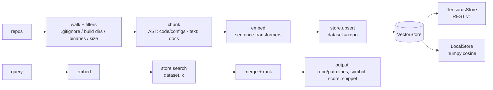
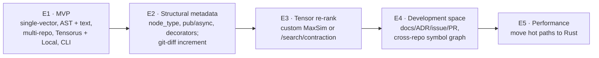

# BRD — Business Requirements Document: WSIndex (Workspace Indexer)

| Field | Value |
|---|---|
| Product | WSIndex (Workspace Indexer) — working title |
| Document version | 1.1 |
| Date | 2026-07-29 |
| Status | Approved for MVP (Phase 1) |
| Type | Business Requirements Document (BRD) |
| Audience | Student author, future developer users, maintainers, AI-agent consumers |

---

## 1. Document purpose and scope

This BRD captures the **business requirements** for the educational project WSIndex — a Python CLI application that indexes a developer's workspace (a set of git repositories) and provides semantic search over it. The document answers the question of "**what** we are doing and **why**", but not "**how** exactly" — the details of classes, API-call schemas, and algorithms are elaborated in the accompanying documents (VISION, ARCHITECTURE, THEORY).

Document scope:

- **In scope:** business and educational goals, stakeholders, MVP scope, functional and non-functional requirements, data requirements, list of integrations, constraints, risks, roadmap, MVP acceptance criteria.
- **Out of scope:** detailed technical design (method signatures, package structure), UX mockups, a test plan as a separate artifact, effort estimates, and a calendar schedule.

The document is proportionate to the project's **educational scale**: it is rigorous enough to serve as a basis for judging MVP readiness, but is deliberately not inflated to a product-grade volume. Product aspects are present only where it is important to "lay the groundwork for the future".

Key principle for interpreting the requirements: priorities are assigned via **MoSCoW** (Must / Should / Could / Won't-now). **Must**-level requirements form the MVP boundary; anything above that is roadmap groundwork.

---

## 2. Context and problem

A modern developer almost never works in a single repository. A typical workspace is **dozens of repositories within one organization**, written in different languages. An illustrative corpus example for WSIndex is the organization **github.com/tensorus**: the repositories `tensorus`, `mcp`, `samples`, `datasets`, `models`, `tensorus-website`, `v1`, `v1_web`, `v1_docs`. This is a polyglot space (Python, Rust, TypeScript) with code, configs, and documentation.

**The problem.** When you need to understand "where has this already been done", "where is such-and-such symbol defined", "where is this configured", a developer is forced to:

- switch between repositories and run a textual `grep` in each;
- know the exact symbol and file names in advance (full-text search does not understand meaning);
- manually assemble the picture from code, configs, and documentation scattered across different projects.

Full-text search does not answer a question posed in **natural language** ("how is the metric configured for a dataset?"), and it does not semantically connect closely related fragments from different repositories. At the same time, an increasing share of queries against the codebase come not from a human but from **AI agents**, who need programmatic access to relevant fragments as context.

**What WSIndex does.** A developer or an AI agent poses a question in natural language (or as a code fragment) and receives relevant fragments **from several repositories at once** — code, configs, documentation — with the source indicated. Everything runs **locally and self-hosted**: the code never leaves the machine. An illustrative growth scenario (a goal, not the MVP): "where is the tensorus API called and what will break if the signature changes" — connecting `mcp`/`samples` → `tensorus`.

**Educational context.** The project simultaneously addresses a second objective — a **learning** one: to go through Retrieval-Augmented Generation (RAG) end to end, to master AST-chunking, vector databases, and the design of clean interfaces on a meaningful rather than a toy example.

---

## 3. Stakeholders

| Role | Who this is | Interest / what matters | How WSIndex addresses it |
|---|---|---|---|
| **Student author** | The project's developer | Go through RAG end-to-end, master AST-chunking, vector DBs, clean interfaces; produce a readable portfolio project | Simple, pedagogical architecture; linear pipeline; Embedder/Chunker/VectorStore interfaces |
| **Future developer users** | Engineers working with multi-repo setups | Quickly find code/configs/docs by meaning, locally and offline | CLI commands `index`/`search`; multi-repo index; "repo/path:lines" output |
| **AI-agent consumers** | LLM agents, MCP tools | Programmatic access to relevant fragments as context | Deterministic, machine-readable search output; local self-hosted stack |
| **Maintainers** | Whoever extends the project after the MVP | Extensibility without rewrites; predictable reindexing | Interface abstractions; idempotency by `id`; two VectorStore backends |

Stakeholder priority in Phase 1 (MVP): the **student author** (educational goals) is primary, the **developer users** and **AI agents** are secondary (we lay in the value), and the **maintainers** are served through the extensibility requirements.

---

## 4. Business goals and success metrics

The goals are deliberately split into **educational** (primary right now) and **product** (laid in for the future).

### 4.1 Educational goals (primary for the MVP)

| ID | Goal | Success metric |
|---|---|---|
| BG-L1 | Go through the full RAG cycle end-to-end | The chain `repos → chunk → embed → store → search` works on the tensorus corpus without manual steps |
| BG-L2 | Master AST-chunking | Code and configs are cut along AST nodes (functions/classes; tables/sections), not by lines; across 3+ languages (Python, Rust, TypeScript) |
| BG-L3 | Master vector DBs | Embeddings are written as tensors into Tensorus v1 and found via HNSW/cosine; the semantics of the dataset and the metric are clear |
| BG-L4 | Design clean interfaces | Two `VectorStore` backends (Tensorus and Local) are implemented behind a single interface; switching backends does not change the pipeline |
| BG-L5 | Ensure reproducibility | Reindexing with no changes in the sources yields the same index (idempotency by `id`) |

### 4.2 Product goals (laid in for the future)

| ID | Goal | Indicator (for future phases) |
|---|---|---|
| BG-P1 | Usefulness of cross-repo search | The share of queries where the needed fragment lands in top-k grows as structural filters are added |
| BG-P2 | Readiness for scale | The index performs adequately on tens of thousands of chunks; hot paths are moved to Rust (E5) |
| BG-P3 | Value for AI agents | WSIndex is used as a context source for an agent/MCP |
| BG-P4 | Ranking quality | Tensor re-rank (MaxSim / late interaction) improves the output order versus single-vector (E3) |

Product metrics are **not** MVP acceptance criteria; they orient the roadmap.

---

## 5. Scope

### 5.1 In scope (MVP, Phase 1)

- Indexing **several repositories into one logical index** with **isolation by source** (one Tensorus dataset per repository). The starting corpus is the `tensorus` organization.
- **Chunking by file type:**
  - **Code and configs** → via **AST (tree-sitter)**: code — functions/classes/methods/blocks; configs (TOML/YAML/JSON/Dockerfile) — along structural nodes (tables/keys/sections/stages).
  - **Documentation** (Markdown/txt/rst, notebook text cells) → as **text** (splitting by headings or a sliding window with overlap).
- **Local embeddings** via sentence-transformers; the model is pluggable (a compact one by default; for code — optionally a code model). Every chunk and every query are embedded with the **same** model.
- **Storage:** a chunk's embedding → a tensor of `shape [dim]` in Tensorus v1 over REST; the chunk's metadata → the JSON field `metadata`.
- **Search:** the query is embedded → Tensorus `/search/similar` (HNSW, cosine) over the relevant datasets → merge and rank → output "repo/path:lines, symbol, score, snippet".
- **CLI commands:** `init`, `add-repo`, `index` (full and incremental), `search`, `status`.
- **VectorStore with two backends:** TensorusStore (primary) and LocalStore (numpy brute-force cosine, a fallback without the Rust server).
- **Traversal filters:** `.gitignore`, binary cutoff, file size limit, standard build/service directories (`node_modules/`, `target/`, `__pycache__/`, `.git/`).
- **MVP increment:** skipping chunks by `id` match (see FR-111). Increment **by git-diff** is already E2.
- **MVP retrieval — single-vector** (one vector per chunk).

### 5.2 Out of scope (roadmap, not now)

- Tensor late-interaction / **MaxSim** re-rank.
- Incremental reindexing **by git-diff** (E2). In the MVP, the increment is only skipping by `id` match.
- A development-space graph (issues / PR / commits), bug trackers.
- Distribution, sharding, cloud.
- An IDE plugin.
- Moving hot paths to Rust.
- Filtering by arbitrary metadata on the server side via property-search (see Section 9 — property-search works only on the mathematical properties of the tensor).

---

## 6. Functional requirements

ID scheme: **FR-1xx** — indexing/ingest; **FR-2xx** — search/retrieval; **FR-3xx** — CLI; **FR-4xx** — storage and Tensorus integration. Priority by MoSCoW.

### 6.1 Indexing / ingest (FR-1xx)

| ID | Requirement | Priority | Acceptance criterion |
|---|---|---|---|
| FR-101 | Index **several repositories** into one logical index | Must | After `index` over 3+ tensorus repositories, search returns hits from different repositories |
| FR-102 | **Traversal** of the repository file tree with filters | Must | All files are traversed except those excluded by filters FR-106..FR-107 |
| FR-103 | **AST-chunking of code** (tree-sitter): functions/classes/methods/blocks | Must | For a file `tensorus/*.py`, chunks correspond to functions/classes with correct `start_line`/`end_line` |
| FR-104 | **AST-chunking of configs** (TOML/YAML/JSON/Dockerfile) along structural nodes | Must | For `pyproject.toml`/`Dockerfile`, chunks correspond to tables/sections/stages |
| FR-105 | **Text-chunking of documentation** (Markdown/txt/rst, notebook text cells): by headings or a sliding window with overlap | Must | For `v1_docs/*.md`, chunks are cut by headings or by an overlapping window |
| FR-106 | Respect **`.gitignore`** and skip standard build/service directories during traversal | Must | Paths from `.gitignore` and the directories `node_modules/`, `target/`, `__pycache__/`, `.git/` do not enter the index |
| FR-107 | Cut off **binary files** and files over the **size limit** | Must | `.png`, `.bin`, and files > the limit are not indexed; the limit is configurable |
| FR-108 | Assign each chunk a **deterministic `id`** (hash of content + path) | Must | Reindexing with no changes yields the same `id`s; a change in content changes the `id` |
| FR-109 | Determine the chunk's **language and kind** (`lang`, `kind` = code/config/doc) | Must | `.rs` → code/rust; `.toml` → config/toml; `.md` → doc/markdown |
| FR-110 | **Full indexing** of the workspace | Must | `index` from scratch builds the index over all added repositories |
| FR-111 | **Incremental indexing**: skipping chunks by `id` match (reindex only what changed) | Should | A repeated `index` after editing one file updates only the affected chunks; unchanged chunks are skipped by `id`. Increment by git-diff — E2 |
| FR-112 | Extract the **symbol name** (`symbol`) and the **node type** (`node_type`) from the AST | Should | For the function `search_similar`, the chunk contains `symbol="search_similar"`, `node_type="function_definition"` |
| FR-113 | **Embed every chunk** with a pluggable local model (sentence-transformers), the same one used for the query | Must | Every chunk gets a vector of dimension `dim`; the model matches the query model (FR-201) |

### 6.2 Search / retrieval (FR-2xx)

| ID | Requirement | Priority | Acceptance criterion |
|---|---|---|---|
| FR-201 | Embed the query with the same model as the chunks | Must | The query and the corpus are embedded with one model; dimensions match |
| FR-202 | **Single-vector search** for the k nearest via Tensorus `/search/similar` | Must | `search "how to create a dataset"` returns ranked hits |
| FR-203 | **Merge and rank** hits from several datasets/repositories | Must | Hits from different repos are merged into a single list sorted by score |
| FR-204 | **Result output**: repo/path:lines, symbol, score, snippet | Must | Each hit shows `repo`, `path`, `start_line-end_line`, `symbol`, `score`, a text fragment |
| FR-205 | Limit the output by the parameter **k** | Must | `search --k 5` returns no more than 5 hits |
| FR-206 | **Client-side post-filter by metadata** (e.g., by `lang` or `repo`) | Should | `search --lang rust` keeps only Rust chunks |
| FR-207 | Operate over **any** VectorStore backend without changing the search logic | Must | `search` gives comparable results on TensorusStore and LocalStore |
| FR-208 | Tensor **re-rank (MaxSim / late interaction)** | Won't-now (E3) | Not implemented in the MVP; laid into the roadmap |

### 6.3 CLI (FR-3xx)

| ID | Requirement | Priority | Acceptance criterion |
|---|---|---|---|
| FR-301 | The **`init`** command — create the workspace config (TOML) | Must | `init` creates a valid workspace TOML config |
| FR-302 | The **`add-repo`** command — add a repository to the workspace | Must | `add-repo <path/url>` registers the repository and its `repo_id` |
| FR-303 | The **`index`** command — full and incremental indexing | Must | `index` builds the index; `index --incremental` updates what changed (increment depth — per FR-111, Should) |
| FR-304 | The **`search`** command — semantic search with parameters (k, filters) | Must | `search "<query>"` returns output per FR-204 |
| FR-305 | The **`status`** command — index state (repositories, chunk count, backend) | Must | `status` shows the list of repositories, the chunk count, and the active backend |
| FR-306 | Meaningful return codes and error messages | Should | An error (no server, no model) gives a clear message and a non-zero code |

### 6.4 Storage and Tensorus integration (FR-4xx)

| ID | Requirement | Priority | Acceptance criterion |
|---|---|---|---|
| FR-401 | A **`VectorStore`** abstraction with a `create / upsert / search` interface | Must | Both implementations plug in behind a single interface; `search` works over one dataset, merging happens in the pipeline |
| FR-402 | **TensorusStore** — a REST client for Tensorus v1 (the primary backend) | Must | Tensors are written and searched via REST v1 |
| FR-403 | **LocalStore** — numpy brute-force cosine, storage in local files (fallback) | Must | The full `index`/`search` cycle works **without** a running Rust server |
| FR-404 | **A dataset per repository** for source isolation | Must | Each `repo_id` corresponds to a separate Tensorus dataset |
| FR-405 | Creating a dataset with the **cosine** metric (idempotently) | Must | `POST /datasets {name, metric:"cosine"}` does not fail on repeat |
| FR-406 | Writing an embedding as a **tensor of `shape [dim]`** with the chunk's `metadata` | Must | `POST /datasets/{ds}/tensors {data, shape:[dim], metadata}` returns a `tensor_id` |
| FR-407 | **Deterministic reindexing**: idempotency is ensured by the deterministic `id` (FR-108); on full reindexing the dataset is recreated | Must | Reindexing with no changes yields the same `id`s; a full reindex does not accumulate duplicates (the dataset is recreated). The recreation mechanism is an open integration question (see R-10) |
| FR-408 | Support for Tensorus **auth**: the `x-api-key` header from `TENSORUS_API_KEY` (or disabled in dev) | Should | When a key is set, requests go out with `x-api-key`; without a key, dev mode works |
| FR-409 | Configurable Tensorus **base URL** (default `http://localhost:8080`) | Should | The URL is changed via config/environment variable |

---

## 7. Non-functional requirements

| ID | Category | Requirement |
|---|---|---|
| NFR-1 | **Simplicity and readability** | Readability and pedagogy matter more than performance; a linear pipeline, minimal "magic" |
| NFR-2 | **Locality / offline** | Everything runs locally and self-hosted; the code never leaves the machine; embeddings are local |
| NFR-3 | **Extensibility** | Extension points via the `Embedder`, `Chunker`, `VectorStore` interfaces; adding a language/model/backend does not break the pipeline |
| NFR-4 | **Determinism** | Reindexing is deterministic; idempotency by `id`; the same input → the same index |
| NFR-5 | **Reasonable scale** | Adequate operation on **tens of thousands of chunks**; millions are already a product (out of MVP) |
| NFR-6 | **Environment portability** | Python 3.11+; installation via pip; the workspace config in TOML |
| NFR-7 | **Resilience to a missing server** | Without a running Tensorus, the project remains operable via LocalStore |

---

## 8. Data requirements

### 8.1 Chunk schema (`Chunk`)

The unit of the index is a **chunk**. Required fields:

| Field | Type | Description | Example (tensorus corpus) |
|---|---|---|---|
| `id` | str | Hash of content + path (deterministic) | `sha256(...)` |
| `repo` | str | Source identifier (`repo_id`) | `tensorus` |
| `path` | str | Path to the file within the repository | `src/search.rs` |
| `lang` | str | Language | `rust` |
| `kind` | str | Allowed values: `code` \| `config` \| `doc` | `code` |
| `symbol` | str? | Symbol name (if applicable) | `search_similar` |
| `node_type` | str? | AST node type (the real tree-sitter node) | `function_definition` |
| `start_line` | int | Start line | `42` |
| `end_line` | int | End line | `88` |
| `text` | str | The fragment text | `fn search_similar(...) { ... }` |

### 8.2 Storage model

- **Isolation by source:** **one Tensorus dataset per repository**. For the tensorus corpus, these are the datasets `tensorus`, `mcp`, `samples`, `datasets`, `models`, `tensorus-website`, `v1`, `v1_web`, `v1_docs`.
- The chunk's **embedding** is stored as a **tensor** of `shape [dim]`, values in **Float32**, the `data` field being a flat row-major array.
- The chunk's **metadata** (all `Chunk` fields except the vector itself) is placed into the tensor's JSON field `metadata`.
- The metric is fixed **per dataset**; for the MVP — **cosine**.

> An important consequence of the data model: `search/property` in Tensorus filters **by the tensor's mathematical properties** (norm, rank, symmetry), and **not** by our `metadata`. Therefore, isolation and filtering by repository and language are done via a **dataset-per-repository** and/or a **client-side post-filter** on `metadata` (FR-206).

---

## 9. Integrations

### 9.1 Tensorus v1 (REST)

Common facts: REST, base URL `http://localhost:8080`, `Content-Type: application/json`. All values are **Float32**; the `data` field is a flat row-major array; `shape` is the dimensions. Auth: single-key mode (the `x-api-key` header with the value from `TENSORUS_API_KEY`) or disabled in dev.

Endpoints used in the MVP:

| Endpoint | Method | Body / parameters | Purpose |
|---|---|---|---|
| `/datasets` | POST | `{name, metric:"cosine"}` | Create a dataset (idempotently); the metric `cosine\|l2\|dot` is fixed per dataset |
| `/datasets/{ds}/tensors` | POST | `{data:[...], shape:[dim], metadata:{...}}` → `{tensor_id, descriptor}` | Write a chunk's embedding as a tensor with metadata |
| `/datasets/{ds}/search/similar` | POST | `{vector:[...], k}` → hits `(tensor_id, score, ...)` | Nearest-neighbor search via HNSW |

Endpoints **not in the MVP** (growth groundwork):

- `/search/contraction` (structural/tensor search) — the basis of tensor **re-rank** in **E3**.
- `/search/property` (filter by the tensor's mathematical properties — norm/rank/symmetry) — **possible growth groundwork, undefined use**; it is unrelated to re-rank and does not filter by our `metadata`.

> Open integration question: the MVP endpoint list has no DELETE/upsert-by-id, so the mechanism for recreating a dataset on full reindexing (FR-407) requires confirmation of the Tensorus v1 contract (see R-10).

### 9.2 tree-sitter

AST parsing for code and configs. Grammars: python, rust, typescript, toml, yaml, json, dockerfile, markdown. Used in FR-103, FR-104, FR-112.

### 9.3 sentence-transformers (+ torch)

Local embeddings for chunks and queries. The model is pluggable: a compact general-purpose one by default; for code — optionally a code model. Used in FR-113 (embedding chunks) and FR-201 (embedding the query) — necessarily the same model.

### 9.4 Rest of the tech stack

Python 3.11+, CLI on **Typer** (Click under the hood), **httpx** (the Tensorus client), dataclasses/pydantic, **pytest**. Installation via pip; the workspace config in TOML.

### 9.5 Architectural core (the pipeline)

The indexing pipeline is linear: `repos → walk(filters) → chunk → embed → store.upsert(dataset=repo)`. Search: `query → embed → store.search(dataset, k) → merge → output`. `search` works over a **single** dataset; iteration over datasets and the merge happen in the pipeline. Both branches go through the single `VectorStore` abstraction with the TensorusStore and LocalStore implementations.

> **Mapping "pipeline step ↔ implementation module"** (details — in ARCHITECTURE): the `walk` step → the `walker` module; `chunk` → `chunker` (the dispatcher) + `ast_chunker`/`text_chunker`; `embed` → `embedder`; `store` → a `VectorStore` implementation. These are the same nodes at different levels of description, not different entities.

---

## 10. Constraints and assumptions

**Constraints:**

- Implementation language — **Python 3.11+**; interface — **CLI** (not GUI, not web).
- Primary backend — **Tensorus v1** over REST; a reachable server at `http://localhost:8080` is assumed (or LocalStore as a fallback).
- Search metric in the MVP — **cosine**; fixed per dataset.
- Retrieval in the MVP — **single-vector**; there is no tensor re-rank.
- Property-search does **not** filter by arbitrary `metadata` — only by the tensor's mathematical properties.
- Target scale — **tens of thousands of chunks**; behavior on millions is not guaranteed.

**Assumptions:**

- Repositories are **git**; available locally for file traversal.
- The starting corpus is the `tensorus` organization (polyglot Python/Rust/TypeScript).
- Grammars for the required languages are available for tree-sitter.
- The embedding model fits into the developer's machine memory and runs offline.
- All embeddings within one index have the same dimension `dim` (one model for the corpus and the queries).
- A deduplication mechanism on the Tensorus side (upsert/DELETE) is not guaranteed by the MVP endpoint list; in the MVP we rely on the deterministic `id` and on recreating the dataset on full reindexing (see R-10).

---

## 11. Risks

| ID | Risk | Type | Prob./Impact | Mitigation |
|---|---|---|---|---|
| R-1 | The Tensorus server is unavailable/unstable, blocking development and tests | Technical | Med./High | **LocalStore** (numpy brute-force) as a fallback — the project works without the Rust server (FR-403) |
| R-2 | Over-complicating the architecture at the expense of educational clarity | Educational | Med./Med. | Keep a linear pipeline and NFR-1 (simplicity > performance); do not pull in features from the roadmap |
| R-3 | Scope creep toward a product | Educational | High/Med. | A hard MoSCoW boundary: MVP = Must only; the rest — E2-E5 |
| R-4 | AST-chunking of configs/languages breaks on edge cases | Technical | Med./Med. | Start with a core set of grammars (python, rust, ts, toml, yaml, json, dockerfile, markdown); degrade to text-chunking on a parser failure |
| R-5 | Mismatch of embedding dimensions/models between the index and the query | Technical | Low/High | One model per index; fix `dim`; check at `search` time |
| R-6 | property-search is mistakenly taken for a filter by metadata | Technical | Med./Med. | Explicitly documented; filtering is via dataset-per-repo and a client-side post-filter (FR-206) |
| R-7 | Non-deterministic reindexing (duplicates, a "floating" index) | Technical | Med./Med. | Deterministic `id` = hash(content+path); reindexing relies on `id` (FR-108, FR-407) |
| R-8 | Incrementality is harder than expected | Educational/tech. | Med./Low | Incrementality is a **Should**, not a Must; the MVP is valid on full reindexing as well |
| R-9 | Large/binary files bloat the index and the time | Technical | Med./Med. | Traversal filters: `.gitignore`, build directories, binary cutoff, size limit (FR-106, FR-107) |
| R-10 | **Open integration question:** the MVP endpoints have no DELETE/upsert-by-id, so duplicate-freeness on full reindexing is not directly supported by the API | Technical/integration | Med./Med. | Confirm the presence of a DELETE endpoint in the Tensorus v1 contract; until confirmed — idempotency via the deterministic `id`, full reindexing = drop+recreate of the dataset (FR-407) |

---

## 12. Roadmap / phases

| Phase | Content |
|---|---|
| **E1 — MVP** | Single-vector; AST for code/configs, text for docs; multi-repo; Tensorus + Local backend; CLI (`init`/`add-repo`/`index`/`search`/`status`). Increment — skipping by `id` match (FR-111) |
| **E2** | Structural metadata from the AST (`node_type`, `pub`/`async`, decorators) as search filters; incremental reindexing by **git-diff** |
| **E3** | **Tensor re-rank**: a custom MaxSim or using Tensorus `/search/contraction` |
| **E4** | **Development space**: docs/ADR/issue/PR as sources; cross-repo links (a symbol graph). Target scenario: "where is the tensorus API called and what will break if the signature changes" (`mcp`/`samples` → `tensorus`) |
| **E5** | Performance and scale: moving hot paths to **Rust** |

---

## 13. MVP acceptance criteria (checklist)

The MVP is considered accepted when **all** the items below are done and verifiable on the tensorus corpus.

- [ ] **Installation:** the project installs via pip on Python 3.11+; `init` creates the workspace TOML config.
- [ ] **Multi-repo:** `add-repo` registers ≥ 3 tensorus repositories (e.g., `tensorus`, `mcp`, `v1_docs`); `status` shows them.
- [ ] **Indexing:** `index` builds the index over all repositories; chunks from several repos land in one logical index.
- [ ] **Source isolation:** each `repo_id` corresponds to a separate Tensorus dataset (dataset-per-repository).
- [ ] **AST-chunking of code:** for `.py`/`.rs`/`.ts`, chunks correspond to functions/classes/methods with correct `start_line`/`end_line`.
- [ ] **AST-chunking of configs:** for `pyproject.toml`/`Dockerfile`, chunks are cut along structural nodes (tables/sections/stages).
- [ ] **Text-chunking of docs:** for `v1_docs/*.md`, chunks are cut by headings or by an overlapping window.
- [ ] **Traversal filters:** `.gitignore` is respected; standard build directories (`node_modules/`, `target/`, `__pycache__/`, `.git/`) are skipped; binaries and files over the size limit are not indexed.
- [ ] **Embeddings:** chunks and the query are embedded with one local model (sentence-transformers), offline.
- [ ] **Writing to Tensorus:** the embedding is written as a tensor of `shape [dim]` (Float32) via `POST /datasets/{ds}/tensors`; `metadata` contains the `Chunk` fields.
- [ ] **Dataset with cosine:** the dataset is created idempotently with `metric:"cosine"`.
- [ ] **Search:** `search "<query in Russian/English>"` returns ranked hits via `/search/similar` with the parameter `k`.
- [ ] **Output:** each hit contains `repo`, `path:start_line-end_line`, `symbol`, `score`, a snippet.
- [ ] **Merge:** results from several datasets/repositories are merged and sorted by score.
- [ ] **Fallback:** the full `index`/`search` cycle works on **LocalStore without** a running Tensorus server.
- [ ] **Determinism:** reindexing with no changes in the sources yields the same `id`s and does not accumulate duplicates.
- [ ] **Interfaces:** switching the `VectorStore` backend (Tensorus ↔ Local) requires no changes in the indexing and search pipeline code.

Incremental indexing (FR-111) and extraction of `symbol`/`node_type` (FR-112) have a **Should** priority and do not block MVP acceptance, provided that full index building is implemented.
