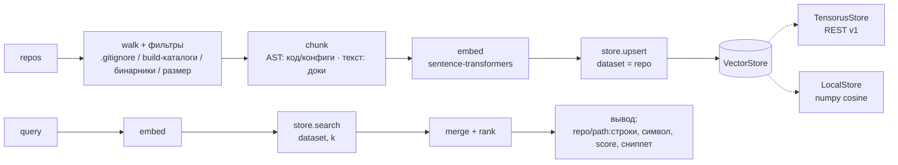
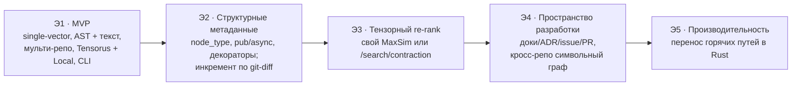

# BRD — Документ бизнес-требований: WSIndex (Workspace Indexer)

| Поле             | Значение                                                                                |
| ---------------- | --------------------------------------------------------------------------------------- |
| Продукт          | WSIndex (Workspace Indexer) — рабочее название                                          |
| Версия документа | 1.1                                                                                     |
| Дата             | 2026-07-29                                                                              |
| Статус           | Утверждён для MVP (Этап 1)                                                              |
| Тип              | Business Requirements Document (BRD)                                                    |
| Аудитория        | Автор-студент, будущие пользователи-разработчики, сопровождающие, потребители-AI-агенты |

______________________________________________________________________

## 1. Назначение и границы документа

Настоящий BRD фиксирует **бизнес-требования** к учебному проекту WSIndex — CLI-приложению на Python, которое индексирует рабочее пространство разработчика (множество git-репозиториев) и даёт по нему семантический поиск. Документ отвечает на вопрос «**что** и **зачем** мы делаем», но не «**как** именно» — детали классов, схем API-вызовов и алгоритмов раскрываются в сопутствующих документах (VISION, ARCHITECTURE, THEORY).

Границы документа:

- **В границах:** бизнес- и учебные цели, заинтересованные стороны, объём MVP, функциональные и нефункциональные требования, требования к данным, перечень интеграций, ограничения, риски, дорожная карта, критерии приёмки MVP.
- **Вне границ:** детальный технический дизайн (сигнатуры методов, структура пакетов), UX-макеты, план тестирования как отдельный артефакт, оценки трудозатрат и календарный график.

Документ соразмерен **учебному масштабу** проекта: он достаточно строг, чтобы по нему можно было принять готовность MVP, но намеренно не раздувается до продуктового объёма. Продуктовые аспекты присутствуют только там, где их важно «заложить на будущее».

Ключевой принцип трактовки требований: приоритеты проставлены по **MoSCoW** (Must / Should / Could / Won't-now). Требования уровня **Must** формируют границу MVP; всё выше — задел дорожной карты.

______________________________________________________________________

## 2. Контекст и проблема

Современный разработчик почти никогда не работает в одном репозитории. Типичное рабочее пространство — это **десятки репозиториев одной организации**, написанных на разных языках. Показательный корпус-пример для WSIndex — организация **github.com/tensorus**: репозитории `tensorus`, `mcp`, `samples`, `datasets`, `models`, `tensorus-website`, `v1`, `v1_web`, `v1_docs`. Это полиглот-пространство (Python, Rust, TypeScript) с кодом, конфигами и документацией.

**Проблема.** Когда нужно понять «где это уже сделано», «где определён такой-то символ», «где это настраивается», разработчик вынужден:

- переключаться между репозиториями и делать текстовый `grep` в каждом;
- знать точные имена символов и файлов заранее (полнотекстовый поиск не понимает смысла);
- вручную собирать картину из кода, конфигов и документации, которые разбросаны по разным проектам.

Полнотекстовый поиск не отвечает на вопрос, заданный **на естественном языке** («как настраивается метрика для датасета?»), и не связывает семантически близкие фрагменты из разных репозиториев. Одновременно всё больше запросов к кодовой базе исходит не от человека, а от **AI-агентов**, которым нужен программный доступ к релевантным фрагментам как к контексту.

**Что делает WSIndex.** Разработчик или AI-агент задаёт вопрос на естественном языке (или фрагментом кода) и получает релевантные фрагменты **сразу из нескольких репозиториев** — код, конфиги, документация — с указанием источника. Всё работает **локально и self-hosted**: код не покидает машину. Показательный сценарий роста (цель, не MVP): «где вызывается API tensorus и что сломается при смене сигнатуры» — связывает `mcp`/`samples` → `tensorus`.

**Учебный контекст.** Проект одновременно решает вторую задачу — **обучающую**: пройти путь Retrieval-Augmented Generation (RAG) от начала до конца, освоить AST-chunking, векторные базы данных и проектирование чистых интерфейсов на осмысленном, а не игрушечном примере.

______________________________________________________________________

## 3. Заинтересованные стороны

| Роль                                  | Кто это                             | Интерес / что важно                                                                                              | Как WSIndex это закрывает                                                                     |
| ------------------------------------- | ----------------------------------- | ---------------------------------------------------------------------------------------------------------------- | --------------------------------------------------------------------------------------------- |
| **Автор-студент**                     | Разработчик проекта                 | Пройти RAG end-to-end, освоить AST-chunking, векторные БД, чистые интерфейсы; получить читаемый портфолио-проект | Простая, педагогичная архитектура; линейный конвейер; интерфейсы Embedder/Chunker/VectorStore |
| **Будущие пользователи-разработчики** | Инженеры, работающие с мульти-репо  | Быстро находить код/конфиги/доки по смыслу, локально и офлайн                                                    | CLI-команды `index`/`search`; мульти-репо индекс; вывод «repo/path:строки»                    |
| **AI-агенты-потребители**             | LLM-агенты, MCP-инструменты         | Программный доступ к релевантным фрагментам как к контексту                                                      | Детерминированный, машиночитаемый вывод поиска; локальный self-hosted стек                    |
| **Сопровождающие**                    | Тот, кто расширяет проект после MVP | Расширяемость без переписывания; предсказуемая переиндексация                                                    | Абстракции-интерфейсы; идемпотентность по `id`; два бэкенда VectorStore                       |

Приоритет заинтересованных сторон на Этапе 1 (MVP): **автор-студент** (учебные цели) первичен, **пользователи-разработчики** и **AI-агенты** — вторичны (закладываем ценность), **сопровождающие** — обслуживаются через требования к расширяемости.

______________________________________________________________________

## 4. Бизнес-цели и метрики успеха

Цели намеренно разделены на **учебные** (главные сейчас) и **продуктовые** (заложены на будущее).

### 4.1 Учебные цели (первичны для MVP)

| ID    | Цель                              | Метрика успеха                                                                                                                |
| ----- | --------------------------------- | ----------------------------------------------------------------------------------------------------------------------------- |
| BG-L1 | Пройти полный цикл RAG end-to-end | Работает цепочка `repos → chunk → embed → store → search` на корпусе tensorus без ручных шагов                                |
| BG-L2 | Освоить AST-chunking              | Код и конфиги режутся по AST-узлам (функции/классы; таблицы/секции), а не по строкам; на 3+ языках (Python, Rust, TypeScript) |
| BG-L3 | Освоить векторные БД              | Эмбеддинги записываются тензорами в Tensorus v1 и находятся через HNSW/cosine; понятна семантика датасета и метрики           |
| BG-L4 | Спроектировать чистые интерфейсы  | Реализованы два бэкенда `VectorStore` (Tensorus и Local) за одним интерфейсом; смена бэкенда не меняет конвейер               |
| BG-L5 | Обеспечить воспроизводимость      | Повторная индексация без изменений в исходниках даёт тот же индекс (идемпотентность по `id`)                                  |

### 4.2 Продуктовые цели (заложены на будущее)

| ID    | Цель                         | Индикатор (для будущих этапов)                                                                  |
| ----- | ---------------------------- | ----------------------------------------------------------------------------------------------- |
| BG-P1 | Полезность кросс-репо поиска | Доля запросов, где нужный фрагмент попадает в top-k, растёт при добавлении структурных фильтров |
| BG-P2 | Готовность к масштабу        | Индекс адекватно работает на десятках тысяч чанков; горячие пути вынесены в Rust (Э5)           |
| BG-P3 | Ценность для AI-агентов      | WSIndex используется как источник контекста для агента/MCP                                      |
| BG-P4 | Качество ранжирования        | Тензорный re-rank (MaxSim / late interaction) улучшает порядок выдачи против single-vector (Э3) |

Продуктовые метрики **не являются** критериями приёмки MVP; они ориентируют дорожную карту.

______________________________________________________________________

## 5. Объём

### 5.1 В объёме (MVP, Этап 1)

- Индексация **нескольких репозиториев в один логический индекс** с **изоляцией по источнику** (один датасет Tensorus на репозиторий). Стартовый корпус — организация `tensorus`.
- **Chunking по типам файлов:**
  - **Код и конфиги** → через **AST (tree-sitter)**: код — функции/классы/методы/блоки; конфиги (TOML/YAML/JSON/Dockerfile) — по структурным узлам (таблицы/ключи/секции/стадии).
  - **Документация** (Markdown/txt/rst, текстовые ячейки ноутбуков) → как **текст** (нарезка по заголовкам либо скользящим окном с перекрытием).
- **Локальные эмбеддинги** через sentence-transformers; модель подключаемая (по умолчанию компактная; для кода — опционально код-модель). Эмбеддится каждый чанк и каждый запрос — **одной и той же** моделью.
- **Хранение:** эмбеддинг чанка → тензор `shape [dim]` в Tensorus v1 по REST; метаданные чанка → JSON-поле `metadata`.
- **Поиск:** запрос эмбеддится → Tensorus `/search/similar` (HNSW, cosine) по нужным датасетам → объединение и ранжирование → вывод «repo/path:строки, символ, оценка, сниппет».
- **CLI-команды:** `init`, `add-repo`, `index` (полная и инкрементальная), `search`, `status`.
- **VectorStore с двумя бэкендами:** TensorusStore (основной) и LocalStore (numpy brute-force cosine, fallback без Rust-сервера).
- **Фильтры обхода:** `.gitignore`, отсечение бинарников, лимит размера файла, стандартные build/служебные каталоги (`node_modules/`, `target/`, `__pycache__/`, `.git/`).
- **MVP-инкремент:** пропуск чанков по совпадению `id` (см. FR-111). Инкремент **по git-diff** — уже Э2.
- **MVP-ретрив — single-vector** (один вектор на чанк).

### 5.2 Вне объёма (дорожная карта, не сейчас)

- Тензорный late-interaction / **MaxSim** re-rank.
- Инкрементальная переиндексация **по git-diff** (Э2). В MVP инкремент — только пропуск по совпадению `id`.
- Граф пространства разработки (issues / PR / commits), баг-трекеры.
- Распределённость, шардирование, облако.
- IDE-плагин.
- Перенос горячих путей в Rust.
- Фильтрация по произвольным metadata на стороне сервера через property-search (см. раздел 9 — property-search работает только по мат-свойствам тензора).

______________________________________________________________________

## 6. Функциональные требования

Схема ID: **FR-1xx** — индексация/ingest; **FR-2xx** — поиск/retrieval; **FR-3xx** — CLI; **FR-4xx** — хранилище и интеграция с Tensorus. Приоритет по MoSCoW.

### 6.1 Индексация / ingest (FR-1xx)

| ID     | Требование                                                                                                                        | Приоритет | Критерий приёмки                                                                                                                                 |
| ------ | --------------------------------------------------------------------------------------------------------------------------------- | --------- | ------------------------------------------------------------------------------------------------------------------------------------------------ |
| FR-101 | Индексировать **несколько репозиториев** в один логический индекс                                                                 | Must      | После `index` по 3+ репозиториям tensorus поиск возвращает хиты из разных репозиториев                                                           |
| FR-102 | **Обход** дерева файлов репозитория с фильтрами                                                                                   | Must      | Обходятся все файлы, кроме исключённых фильтрами FR-106..FR-107                                                                                  |
| FR-103 | **AST-chunking кода** (tree-sitter): функции/классы/методы/блоки                                                                  | Must      | Для файла `tensorus/*.py` чанки соответствуют функциям/классам с корректными `start_line`/`end_line`                                             |
| FR-104 | **AST-chunking конфигов** (TOML/YAML/JSON/Dockerfile) по структурным узлам                                                        | Must      | Для `pyproject.toml`/`Dockerfile` чанки соответствуют таблицам/секциям/стадиям                                                                   |
| FR-105 | **Текст-chunking документации** (Markdown/txt/rst, текстовые ячейки ноутбуков): по заголовкам либо скользящим окном с перекрытием | Must      | Для `v1_docs/*.md` чанки режутся по заголовкам или окном с перекрытием                                                                           |
| FR-106 | Уважать **`.gitignore`** и пропускать стандартные build/служебные каталоги при обходе                                             | Must      | Пути из `.gitignore` и каталоги `node_modules/`, `target/`, `__pycache__/`, `.git/` не попадают в индекс                                         |
| FR-107 | Отсекать **бинарные файлы** и файлы сверх **лимита размера**                                                                      | Must      | `.png`, `.bin`, файлы > лимита не индексируются; лимит настраивается                                                                             |
| FR-108 | Присваивать каждому чанку **детерминированный `id`** (хеш содержимого + пути)                                                     | Must      | Повторная индексация без изменений даёт те же `id`; изменение содержимого меняет `id`                                                            |
| FR-109 | Определять **язык и вид** чанка (`lang`, `kind` = code/config/doc)                                                                | Must      | `.rs` → code/rust; `.toml` → config/toml; `.md` → doc/markdown                                                                                   |
| FR-110 | **Полная индексация** рабочего пространства                                                                                       | Must      | `index` с нуля строит индекс по всем добавленным репозиториям                                                                                    |
| FR-111 | **Инкрементальная индексация**: пропуск чанков по совпадению `id` (переиндексация только изменённого)                             | Should    | Повторный `index` после правки одного файла обновляет только затронутые чанки; неизменные чанки пропускаются по `id`. Инкремент по git-diff — Э2 |
| FR-112 | Извлекать **имя символа** (`symbol`) и **тип узла** (`node_type`) из AST                                                          | Should    | Для функции `search_similar` чанк содержит `symbol="search_similar"`, `node_type="function_definition"`                                          |
| FR-113 | **Эмбеддить каждый чанк** подключаемой локальной моделью (sentence-transformers), той же, что и для запроса                       | Must      | Каждый чанк получает вектор размерности `dim`; модель совпадает с моделью запроса (FR-201)                                                       |

### 6.2 Поиск / retrieval (FR-2xx)

| ID     | Требование                                                                 | Приоритет      | Критерий приёмки                                                                                |
| ------ | -------------------------------------------------------------------------- | -------------- | ----------------------------------------------------------------------------------------------- |
| FR-201 | Эмбеддить запрос той же моделью, что и чанки                               | Must           | Запрос и корпус эмбеддятся одной моделью; размерности совпадают                                 |
| FR-202 | **Single-vector поиск** по k ближайших через Tensorus `/search/similar`    | Must           | `search "как создать датасет"` возвращает ранжированные хиты                                    |
| FR-203 | **Объединение и ранжирование** хитов из нескольких датасетов/репозиториев  | Must           | Хиты из разных репо сливаются в единый список, отсортированный по score                         |
| FR-204 | **Вывод результата**: repo/path:строки, символ, оценка, сниппет            | Must           | Каждый хит показывает `repo`, `path`, `start_line-end_line`, `symbol`, `score`, фрагмент текста |
| FR-205 | Ограничивать выдачу параметром **k**                                       | Must           | `search --k 5` возвращает не более 5 хитов                                                      |
| FR-206 | **Клиентский пост-фильтр по metadata** (например, по `lang` или `repo`)    | Should         | `search --lang rust` оставляет только чанки Rust                                                |
| FR-207 | Работать поверх **любого бэкенда** VectorStore без изменения логики поиска | Must           | `search` даёт сопоставимый результат на TensorusStore и LocalStore                              |
| FR-208 | Тензорный **re-rank (MaxSim / late interaction)**                          | Won't-now (Э3) | Не реализуется в MVP; заложен в дорожную карту                                                  |

### 6.3 CLI (FR-3xx)

| ID     | Требование                                                                   | Приоритет | Критерий приёмки                                                                                           |
| ------ | ---------------------------------------------------------------------------- | --------- | ---------------------------------------------------------------------------------------------------------- |
| FR-301 | Команда **`init`** — создать конфиг рабочего пространства (TOML)             | Must      | `init` создаёт валидный TOML-конфиг workspace                                                              |
| FR-302 | Команда **`add-repo`** — добавить репозиторий в рабочее пространство         | Must      | `add-repo <path/url>` регистрирует репозиторий и его `repo_id`                                             |
| FR-303 | Команда **`index`** — полная и инкрементальная индексация                    | Must      | `index` строит индекс; `index --incremental` обновляет изменённое (глубина инкремента — по FR-111, Should) |
| FR-304 | Команда **`search`** — семантический поиск с параметрами (k, фильтры)        | Must      | `search "<запрос>"` возвращает вывод по FR-204                                                             |
| FR-305 | Команда **`status`** — состояние индекса (репозитории, число чанков, бэкенд) | Must      | `status` показывает список репозиториев, количество чанков и активный бэкенд                               |
| FR-306 | Осмысленные коды возврата и сообщения об ошибках                             | Should    | Ошибка (нет сервера, нет модели) даёт понятное сообщение и ненулевой код                                   |

### 6.4 Хранилище и интеграция с Tensorus (FR-4xx)

| ID     | Требование                                                                                                                                            | Приоритет | Критерий приёмки                                                                                                                                                                          |
| ------ | ----------------------------------------------------------------------------------------------------------------------------------------------------- | --------- | ----------------------------------------------------------------------------------------------------------------------------------------------------------------------------------------- |
| FR-401 | Абстракция **`VectorStore`** с интерфейсом `create / upsert / search`                                                                                 | Must      | Обе реализации подключаются за одним интерфейсом; `search` работает по одному датасету, объединение — в конвейере                                                                         |
| FR-402 | **TensorusStore** — REST-клиент к Tensorus v1 (основной бэкенд)                                                                                       | Must      | Тензоры записываются и ищутся через REST v1                                                                                                                                               |
| FR-403 | **LocalStore** — numpy brute-force cosine, хранение в локальных файлах (fallback)                                                                     | Must      | Полный цикл `index`/`search` работает **без** поднятого Rust-сервера                                                                                                                      |
| FR-404 | **Датасет на репозиторий** для изоляции источника                                                                                                     | Must      | Каждому `repo_id` соответствует отдельный датасет Tensorus                                                                                                                                |
| FR-405 | Создание датасета с метрикой **cosine** (идемпотентно)                                                                                                | Must      | `POST /datasets {name, metric:"cosine"}` не падает при повторе                                                                                                                            |
| FR-406 | Запись эмбеддинга как **тензора `shape [dim]`** с `metadata` чанка                                                                                    | Must      | `POST /datasets/{ds}/tensors {data, shape:[dim], metadata}` возвращает `tensor_id`                                                                                                        |
| FR-407 | **Детерминированная переиндексация**: идемпотентность обеспечивается детерминированным `id` (FR-108); при полной переиндексации датасет пересоздаётся | Must      | Повторная индексация без изменений даёт те же `id`; полная переиндексация не накапливает дубликаты (датасет пересоздаётся). Механизм пересоздания — открытый вопрос интеграции (см. R-10) |
| FR-408 | Поддержка **auth** Tensorus: заголовок `x-api-key` из `TENSORUS_API_KEY` (или выключено в dev)                                                        | Should    | При заданном ключе запросы уходят с `x-api-key`; без ключа работает dev-режим                                                                                                             |
| FR-409 | Конфигурируемый **base URL** Tensorus (по умолчанию `http://localhost:8080`)                                                                          | Should    | URL меняется через конфиг/переменную окружения                                                                                                                                            |

______________________________________________________________________

## 7. Нефункциональные требования

| ID    | Категория                                   | Требование                                                                                                                 |
| ----- | ------------------------------------------- | -------------------------------------------------------------------------------------------------------------------------- |
| NFR-1 | **Простота и читаемость**                   | Читаемость и педагогичность важнее производительности; линейный конвейер, минимум «магии»                                  |
| NFR-2 | **Локальность / офлайн**                    | Всё работает локально и self-hosted; код не покидает машину; эмбеддинги локальные                                          |
| NFR-3 | **Расширяемость**                           | Точки расширения через интерфейсы `Embedder`, `Chunker`, `VectorStore`; добавление языка/модели/бэкенда не ломает конвейер |
| NFR-4 | **Детерминизм**                             | Переиндексация детерминирована; идемпотентность по `id`; один и тот же вход → один и тот же индекс                         |
| NFR-5 | **Разумный масштаб**                        | Адекватная работа на **десятках тысяч чанков**; миллионы — уже продукт (вне MVP)                                           |
| NFR-6 | **Переносимость окружения**                 | Python 3.11+; установка через pip; конфиг рабочего пространства в TOML                                                     |
| NFR-7 | **Отказоустойчивость к отсутствию сервера** | Без поднятого Tensorus проект остаётся работоспособным через LocalStore                                                    |

______________________________________________________________________

## 8. Требования к данным

### 8.1 Схема чанка (`Chunk`)

Единица индекса — **чанк (chunk)**. Обязательные поля:

| Поле         | Тип  | Описание                                         | Пример (корпус tensorus)         |
| ------------ | ---- | ------------------------------------------------ | -------------------------------- |
| `id`         | str  | Хеш содержимого + пути (детерминированный)       | `sha256(...)`                    |
| `repo`       | str  | Идентификатор источника (`repo_id`)              | `tensorus`                       |
| `path`       | str  | Путь к файлу внутри репозитория                  | `src/search.rs`                  |
| `lang`       | str  | Язык                                             | `rust`                           |
| `kind`       | str  | Допустимые значения: `code` \| `config` \| `doc` | `code`                           |
| `symbol`     | str? | Имя символа (если применимо)                     | `search_similar`                 |
| `node_type`  | str? | Тип AST-узла (реальный узел tree-sitter)         | `function_definition`            |
| `start_line` | int  | Начальная строка                                 | `42`                             |
| `end_line`   | int  | Конечная строка                                  | `88`                             |
| `text`       | str  | Текст фрагмента                                  | `fn search_similar(...) { ... }` |

### 8.2 Модель хранения

- **Изоляция по источнику:** **один датасет Tensorus на репозиторий**. Для корпуса tensorus это датасеты `tensorus`, `mcp`, `samples`, `datasets`, `models`, `tensorus-website`, `v1`, `v1_web`, `v1_docs`.
- **Эмбеддинг** чанка хранится как **тензор** `shape [dim]`, значения **Float32**, поле `data` — плоский row-major массив.
- **Метаданные** чанка (все поля `Chunk`, кроме собственно вектора) кладутся в JSON-поле `metadata` тензора.
- Метрика фиксируется **на датасет**; для MVP — **cosine**.

> Важное следствие модели данных: `search/property` в Tensorus фильтрует **по мат-свойствам тензора** (норма, ранг, симметричность), а **не** по нашим `metadata`. Поэтому изоляция и фильтрация по репозиторию и языку делаются через **датасет-на-репозиторий** и/или **клиентский пост-фильтр** по `metadata` (FR-206).

______________________________________________________________________

## 9. Интеграции

### 9.1 Tensorus v1 (REST)

Общие факты: REST, base URL `http://localhost:8080`, `Content-Type: application/json`. Все значения **Float32**; поле `data` — плоский row-major массив; `shape` — размерности. Auth: single-key режим (заголовок `x-api-key` со значением из `TENSORUS_API_KEY`) либо выключен в dev.

Используемые эндпоинты MVP:

| Эндпоинт                        | Метод | Тело / параметры                                                        | Назначение                                                                       |
| ------------------------------- | ----- | ----------------------------------------------------------------------- | -------------------------------------------------------------------------------- |
| `/datasets`                     | POST  | `{name, metric:"cosine"}`                                               | Создать датасет (идемпотентно); метрика `cosine\|l2\|dot` фиксируется на датасет |
| `/datasets/{ds}/tensors`        | POST  | `{data:[...], shape:[dim], metadata:{...}}` → `{tensor_id, descriptor}` | Записать эмбеддинг чанка тензором с метаданными                                  |
| `/datasets/{ds}/search/similar` | POST  | `{vector:[...], k}` → хиты `(tensor_id, score, ...)`                    | Поиск ближайших через HNSW                                                       |

Эндпоинты **не в MVP** (задел роста):

- `/search/contraction` (структурный/тензорный поиск) — основа тензорного **re-rank** на **Э3**.
- `/search/property` (фильтр по мат-свойствам тензора — норма/ранг/симметричность) — **возможный задел роста, применение неопределённое**; к re-rank отношения не имеет и по нашим `metadata` не фильтрует.

> Открытый вопрос интеграции: в перечне эндпоинтов MVP нет DELETE/upsert-by-id, поэтому механизм пересоздания датасета при полной переиндексации (FR-407) требует подтверждения контракта Tensorus v1 (см. R-10).

### 9.2 tree-sitter

Парсинг AST для кода и конфигов. Грамматики: python, rust, typescript, toml, yaml, json, dockerfile, markdown. Используется в FR-103, FR-104, FR-112.

### 9.3 sentence-transformers (+ torch)

Локальные эмбеддинги для чанков и запросов. Модель подключаемая: по умолчанию компактная универсальная; для кода — опционально код-модель. Используется в FR-113 (эмбеддинг чанков) и FR-201 (эмбеддинг запроса) — обязательно одна и та же модель.

### 9.4 Прочий тех-стек

Python 3.11+, CLI на **Typer** (Click под капотом), **httpx** (клиент Tensorus), dataclasses/pydantic, **pytest**. Установка через pip; конфиг рабочего пространства — TOML.

### 9.5 Архитектурное ядро (конвейер)

Конвейер индексации линеен: `repos → walk(фильтры) → chunk → embed → store.upsert(dataset=repo)`. Поиск: `query → embed → store.search(dataset, k) → merge → вывод`. `search` работает по **одному** датасету; итерация по датасетам и объединение (merge) — в конвейере (pipeline). Обе ветви идут через единую абстракцию `VectorStore` с реализациями TensorusStore и LocalStore.

> **Соответствие «шаг конвейера ↔ модуль реализации»** (детали — в ARCHITECTURE): шаг `walk` → модуль `walker`; `chunk` → `chunker` (диспетчер) + `ast_chunker`/`text_chunker`; `embed` → `embedder`; `store` → реализация `VectorStore`. Это одни и те же узлы на разных уровнях описания, а не разные сущности.

______________________________________________________________________

## 10. Ограничения и допущения

**Ограничения:**

- Язык реализации — **Python 3.11+**; интерфейс — **CLI** (не GUI, не веб).
- Основной бэкенд — **Tensorus v1** по REST; предполагается доступный сервер на `http://localhost:8080` (или LocalStore как fallback).
- Метрика поиска в MVP — **cosine**; фиксируется на датасет.
- Ретрив в MVP — **single-vector**; тензорный re-rank отсутствует.
- Property-search **не** фильтрует по произвольным `metadata` — только по мат-свойствам тензора.
- Целевой масштаб — **десятки тысяч чанков**; на миллионах поведение не гарантируется.

**Допущения:**

- Репозитории — **git**; доступны локально для обхода файлов.
- Стартовый корпус — организация `tensorus` (полиглот Python/Rust/TypeScript).
- Для tree-sitter доступны грамматики нужных языков.
- Модель эмбеддингов помещается в память машины разработчика и работает офлайн.
- Все эмбеддинги в рамках одного индекса имеют одинаковую размерность `dim` (одна модель для корпуса и запросов).
- Механизм устранения дубликатов на стороне Tensorus (upsert/DELETE) не гарантирован перечнем эндпоинтов MVP; в MVP полагаемся на детерминированный `id` и пересоздание датасета при полной переиндексации (см. R-10).

______________________________________________________________________

## 11. Риски

| ID   | Риск                                                                                                                                                    | Тип                    | Вероятн./Влияние | Митигация                                                                                                                                                                              |
| ---- | ------------------------------------------------------------------------------------------------------------------------------------------------------- | ---------------------- | ---------------- | -------------------------------------------------------------------------------------------------------------------------------------------------------------------------------------- |
| R-1  | Недоступен/нестабилен Tensorus-сервер, блокирует разработку и тесты                                                                                     | Технический            | Ср./Выс.         | **LocalStore** (numpy brute-force) как fallback — проект работает без Rust-сервера (FR-403)                                                                                            |
| R-2  | Переусложнение архитектуры в ущерб учебной ясности                                                                                                      | Учебный                | Ср./Ср.          | Держать линейный конвейер и NFR-1 (простота > производительность); не тянуть фичи из дорожной карты                                                                                    |
| R-3  | Расползание объёма (scope creep) в сторону продукта                                                                                                     | Учебный                | Выс./Ср.         | Жёсткая граница MoSCoW: MVP = только Must; остальное — Э2-Э5                                                                                                                           |
| R-4  | AST-chunking конфигов/языков ломается на краевых случаях                                                                                                | Технический            | Ср./Ср.          | Начать с ядра грамматик (python, rust, ts, toml, yaml, json, dockerfile, markdown); деградация к текст-chunking при сбое парсера                                                       |
| R-5  | Несовпадение размерностей/моделей эмбеддингов между индексом и запросом                                                                                 | Технический            | Низ./Выс.        | Одна модель на индекс; фиксировать `dim`; проверка при `search`                                                                                                                        |
| R-6  | property-search ошибочно принимается за фильтр по metadata                                                                                              | Технический            | Ср./Ср.          | Явно задокументировано; фильтрация — через датасет-на-репо и клиентский пост-фильтр (FR-206)                                                                                           |
| R-7  | Недетерминированная переиндексация (дубликаты, «плавающий» индекс)                                                                                      | Технический            | Ср./Ср.          | Детерминированный `id` = хеш(содержимое+путь); переиндексация опирается на `id` (FR-108, FR-407)                                                                                       |
| R-8  | Инкрементальность сложнее, чем ожидалось                                                                                                                | Учебный/техн.          | Ср./Низ.         | Инкрементальность — **Should**, не Must; MVP валиден и на полной переиндексации                                                                                                        |
| R-9  | Большие/бинарные файлы раздувают индекс и время                                                                                                         | Технический            | Ср./Ср.          | Фильтры обхода: `.gitignore`, build-каталоги, отсечение бинарников, лимит размера (FR-106, FR-107)                                                                                     |
| R-10 | **Открытый вопрос интеграции:** в эндпоинтах MVP нет DELETE/upsert-by-id, поэтому бездубликатность при полной переиндексации не поддержана API напрямую | Технический/интеграция | Ср./Ср.          | Подтвердить наличие DELETE-эндпоинта в контракте Tensorus v1; до подтверждения — идемпотентность через детерминированный `id`, полная переиндексация = drop+recreate датасета (FR-407) |

______________________________________________________________________

## 12. Дорожная карта / фазы

| Этап         | Содержание                                                                                                                                                                                                           |
| ------------ | -------------------------------------------------------------------------------------------------------------------------------------------------------------------------------------------------------------------- |
| **Э1 — MVP** | Single-vector; AST для кода/конфигов, текст для доков; мульти-репо; backend Tensorus + Local; CLI (`init`/`add-repo`/`index`/`search`/`status`). Инкремент — пропуск по совпадению `id` (FR-111)                     |
| **Э2**       | Структурные метаданные из AST (`node_type`, `pub`/`async`, декораторы) как фильтры поиска; инкрементальная переиндексация по **git-diff**                                                                            |
| **Э3**       | **Тензорный re-rank**: свой MaxSim либо использование `/search/contraction` Tensorus                                                                                                                                 |
| **Э4**       | **Пространство разработки**: доки/ADR/issue/PR как источники; кросс-репо связи (символьный граф). Целевой сценарий: «где вызывается API tensorus и что сломается при смене сигнатуры» (`mcp`/`samples` → `tensorus`) |
| **Э5**       | Производительность и масштаб: перенос горячих путей в **Rust**                                                                                                                                                       |

______________________________________________________________________

## 13. Критерии приёмки MVP (чек-лист)

MVP считается принятым, когда **все** пункты ниже выполнены и проверяемы на корпусе tensorus.

- [ ] **Установка:** проект ставится через pip на Python 3.11+; `init` создаёт TOML-конфиг рабочего пространства.
- [ ] **Мульти-репо:** `add-repo` регистрирует ≥ 3 репозиториев tensorus (например, `tensorus`, `mcp`, `v1_docs`); `status` их показывает.
- [ ] **Индексация:** `index` строит индекс по всем репозиториям; в один логический индекс попадают чанки из нескольких репо.
- [ ] **Изоляция источника:** каждому `repo_id` соответствует отдельный датасет Tensorus (датасет-на-репозиторий).
- [ ] **AST-chunking кода:** для `.py`/`.rs`/`.ts` чанки соответствуют функциям/классам/методам с корректными `start_line`/`end_line`.
- [ ] **AST-chunking конфигов:** для `pyproject.toml`/`Dockerfile` чанки режутся по структурным узлам (таблицы/секции/стадии).
- [ ] **Текст-chunking доков:** для `v1_docs/*.md` чанки режутся по заголовкам либо окном с перекрытием.
- [ ] **Фильтры обхода:** `.gitignore` соблюдается; стандартные build-каталоги (`node_modules/`, `target/`, `__pycache__/`, `.git/`) пропускаются; бинарники и файлы сверх лимита размера не индексируются.
- [ ] **Эмбеддинги:** чанки и запрос эмбеддятся одной локальной моделью (sentence-transformers), офлайн.
- [ ] **Запись в Tensorus:** эмбеддинг записывается тензором `shape [dim]` (Float32) через `POST /datasets/{ds}/tensors`; `metadata` содержит поля `Chunk`.
- [ ] **Датасет с cosine:** датасет создаётся идемпотентно с `metric:"cosine"`.
- [ ] **Поиск:** `search "<запрос на русском/английском>"` возвращает ранжированные хиты через `/search/similar` с параметром `k`.
- [ ] **Вывод:** каждый хит содержит `repo`, `path:start_line-end_line`, `symbol`, `score`, сниппет.
- [ ] **Объединение:** результаты из нескольких датасетов/репозиториев сливаются и сортируются по score.
- [ ] **Fallback:** полный цикл `index`/`search` работает на **LocalStore без** поднятого Tensorus-сервера.
- [ ] **Детерминизм:** повторная индексация без изменений в исходниках даёт те же `id` и не накапливает дубликаты.
- [ ] **Интерфейсы:** смена бэкенда `VectorStore` (Tensorus ↔ Local) не требует изменений в коде конвейера индексации и поиска.

Инкрементальная индексация (FR-111) и извлечение `symbol`/`node_type` (FR-112) имеют приоритет **Should** и не блокируют приёмку MVP, если реализовано полное построение индекса.
