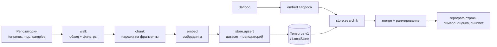

# WSIndex — Концепт (одностраничник)

## 1. Проблема: почему искать по нескольким репозиториям трудно

Представьте команду, у которой не один проект, а целая организация репозиториев. Возьмём реальный пример — организацию `tensorus` на GitHub: там соседствуют `tensorus`, `mcp`, `samples`, `datasets`, `models`, `tensorus-website`, а также `v1`, `v1_web`, `v1_docs`. Это полиглот: код на Python, Rust и TypeScript, конфиги (TOML/YAML/JSON, Dockerfile), документация (Markdown, txt, rst, ноутбуки). Знание о том, «как что устроено», размазано по десяткам мест.

Когда разработчик спрашивает «а где у нас уже сделана авторизация по ключу?», «где определяется формат тензора?» или «где настраивается порт сервиса?», обычный поиск подводит сразу с нескольких сторон:

- **Границы репозиториев.** `grep` и поиск в IDE работают внутри одного проекта. Ответ же часто лежит в другом: обращение к API происходит в `mcp` и `samples`, а само определение — в `tensorus`.
- **Поиск по буквам, а не по смыслу.** Текстовый поиск найдёт слово «token», но пропустит `api_key`, `credential` или комментарий «ключ доступа». Нужен поиск по значению, а не по совпадению символов.
- **Разнородность артефактов.** Функция на Rust, ключ в `pyproject.toml`, стадия в `Dockerfile` и абзац в README устроены совершенно по-разному. Нарезать их «одним ножом» на строки или страницы — значит терять структуру и контекст.

Итог: знание есть, но оно не находится. Человек тратит время на археологию, а AI-агент вообще не имеет единой точки входа в кодовую базу.

## 2. Идея решения (в двух абзацах)

**WSIndex** (Workspace Indexer) — это CLI-приложение на Python, которое индексирует всё рабочее пространство разработчика (для начала — множество git-репозиториев) в один логический индекс и даёт по нему семантический поиск. Вы задаёте вопрос на естественном языке или прямо кодом — и получаете релевантные фрагменты сразу из нескольких репозиториев: код, конфиги, документацию. По сути это ответ на вопросы «где это уже сделано», «где определено» и «где настраивается».

Всё работает **локально и self-hosted**: репозитории, модель для эмбеддингов и база данных живут на вашей машине, код никуда не уходит. WSIndex начинается как учебный проект — намеренно простой, читаемый и педагогичный, — но его архитектура заложена так, чтобы вырасти в полноценный продукт: единое «пространство разработки» с поиском по смыслу для людей и агентов.

## 3. Как это работает простыми словами

Индексация — это линейный конвейер из нескольких шагов; поиск — его зеркальное отражение.

1. **Собираем файлы.** Обходим репозитории, применяя фильтры (пропускаем мусор вроде сборочных артефактов).
1. **Режем на чанки.** Каждый файл делится на осмысленные фрагменты — «чанки». Код и конфиги — по структуре, документы — по тексту (об этом ниже).
1. **Считаем эмбеддинги.** Локальная модель (`sentence-transformers`) превращает каждый чанк в вектор чисел — «координаты смысла». Та же модель эмбеддит и поисковый запрос.
1. **Сохраняем.** Вектор пишется в базу, а рядом — метаданные чанка (репозиторий, путь, язык, символ, строки). Каждому репозиторию — свой отдельный датасет.
1. **Ищем.** Запрос тоже превращается в вектор, база находит ближайшие по смыслу чанки в нужных датасетах, результаты объединяются и ранжируются.
1. **Показываем.** Ответ выглядит как `repo/path:строки, символ, оценка, сниппет` — сразу понятно, куда идти.

Команды CLI покрывают весь цикл: `init`, `add-repo`, `index` (полная и инкрементальная), `search`, `status`.

## 4. Почему код и конфиги — через AST, а документы — как текст

Ключевая интуиция: **разные артефакты имеют разную «естественную» единицу смысла**.

У кода эта единица — функция, класс, метод. Поэтому код и конфиги мы разбираем через AST (синтаксическое дерево, `tree-sitter`): для кода чанк — это целая функция или класс, для конфигов — структурный узел (таблица в TOML, ключ в YAML, стадия в Dockerfile). Так чанк остаётся цельным и осмысленным: искать «функцию авторизации» логичнее, чем «строки 40–55». Заодно AST даёт бесплатные метаданные — имя символа (`symbol`), тип узла (`node_type`).

У документации иная природа: связный текст без жёсткого синтаксиса. Резать README по «узлам» бессмысленно — там нет функций. Поэтому Markdown, txt, rst и текстовые ячейки ноутбуков нарезаются **как текст**: по заголовкам либо скользящим окном с перекрытием, чтобы мысль не обрывалась на середине абзаца.

| Тип артефакта | Пример из корпуса                  | Как режем         | Единица чанка                      |
| ------------- | ---------------------------------- | ----------------- | ---------------------------------- |
| Код           | `tensorus`, `mcp` (Python/Rust/TS) | AST (tree-sitter) | функция / класс / метод            |
| Конфиги       | `pyproject.toml`, `Dockerfile`     | AST по узлам      | таблица / ключ / стадия            |
| Документация  | `v1_docs`, README                  | текст             | по заголовкам / окно с перекрытием |

## 5. Почему Tensorus v1 как база данных

Хранилище индекса — **Tensorus v1** (`github.com/tensorus/v1`), тензорная база с REST-API. Выбор не случаен и снимает с нас самую сложную часть.

- **Не надо строить ANN-индекс руками.** Tensorus даёт готовый поиск ближайших векторов на HNSW. Мы отправляем `POST /datasets/{ds}/search/similar` с телом `{vector, k}` — и получаем список хитов (`tensor_id`, `score`).
- **Простой и предсказуемый API.** База по адресу `http://localhost:8080`, `Content-Type: application/json`, все значения Float32. Датасет создаётся идемпотентно через `POST /datasets` с телом `{name, metric:"cosine"}`. Эмбеддинг чанка пишется как тензор: `POST /datasets/{ds}/tensors` с `{data, shape:[dim], metadata:{...}}`, метаданные чанка кладутся в поле `metadata`.
- **Тематическая уместность.** Хранить векторы в тензорной БД — концептуально «в тему»; а на этапе роста пригодятся её же `/search/property` и `/search/contraction`.

Важный нюанс, который мы учитываем сразу: `property-search` фильтрует по **математическим** свойствам тензора (норма, ранг, симметричность), а не по нашим `metadata`. Поэтому изоляцию по репозиторию делаем архитектурно — **один датасет на репозиторий** — плюс клиентский пост-фильтр по метаданным.

Отдельно — про переносимость. Всё хранилище спрятано за абстракцией `VectorStore` (интерфейс `create/upsert/search`) с двумя реализациями: основная — `TensorusStore` (REST к v1); запасная — `LocalStore` (brute-force cosine на numpy, хранение в локальных файлах). `LocalStore` позволяет проекту работать и без поднятого Rust-сервера, что важно для учёбы и тестов.

## 6. Что входит в MVP, а чего пока нет

| В MVP (делаем сейчас)                                                         | Вне MVP (дорожная карта)                         |
| ----------------------------------------------------------------------------- | ------------------------------------------------ |
| Индексация нескольких репозиториев в один индекс                              | Тензорный re-rank / late interaction (MaxSim)    |
| AST-чанкинг кода и конфигов, текст для доков                                  | Граф пространства разработки (issues/PR/commits) |
| Локальные эмбеддинги (`sentence-transformers`)                                | Инкремент по git-diff (Э2)                       |
| Хранение: `TensorusStore` + `LocalStore`                                      | Распределённость, шардирование, облако           |
| Поиск single-vector (один вектор на чанк)                                     | IDE-плагин, перенос горячих путей в Rust         |
| CLI: `init`, `add-repo`, `index`, `search`, `status`                          |                                                  |
| Инкрементальный `index`: пропуск чанков по совпадению `id` (приоритет Should) |                                                  |

**Про инкремент — чтобы не путать два разных смысла.** В MVP «инкрементальная» переиндексация — это простой пропуск чанков, чей `id` (хеш содержимого + пути) уже проиндексирован; приоритет — Should. Более умный инкремент по `git diff` (переиндексировать только изменённые файлы) — это уже Э2, он в «Вне MVP».

**Про идемпотентность — честно про ограничение API.** Перечисленные эндпоинты Tensorus дают только создание тензора (`POST /tensors`), без upsert-by-id и без удаления. Поэтому детерминизм переиндексации мы обеспечиваем детерминированными `id`: инкрементальный прогон пропускает уже известные `id`, а полная переиндексация пересоздаёт датасет репозитория заново. Строгий upsert без дубликатов на стороне v1 — открытый вопрос интеграции, а не обещание MVP.

Честно про масштаб: это учебный проект. Простота и читаемость важнее производительности; цель — адекватная работа на десятках тысяч чанков, а не на миллионах.

## 7. Ценность: разработчику и AI-агенту

**Разработчику** WSIndex экономит время на «где это уже сделано». Вместо обхода десяти репозиториев вручную — один вопрос и ответ вида `mcp/client.py:42, call_api, 0.87`. Онбординг в незнакомую кодовую базу ускоряется: можно спрашивать по смыслу, а не угадывать слова.

**AI-агенту** WSIndex даёт единую точку входа в код — инструмент, который по запросу возвращает точные фрагменты из всего рабочего пространства. Агент перестаёт «галлюцинировать» про структуру проекта и работает с реальными сниппетами. Показательный кросс-репо сценарий (цель роста): «где вызывается API `tensorus` и что сломается при смене сигнатуры» — он связывает `mcp` и `samples` с определением в `tensorus`.

## 8. Видение роста в продукт

- **Э1 — MVP:** single-vector, AST для кода/конфигов, текст для доков, мульти-репо, бэкенды Tensorus и Local, CLI.
- **Э2:** структурные метаданные из AST (`node_type`, `pub`/`async`, декораторы) как фильтры поиска; инкрементальная переиндексация по git-diff.
- **Э3:** тензорный re-rank — свой MaxSim либо `/search/contraction` Tensorus.
- **Э4:** пространство разработки — доки/ADR/issue/PR как источники, кросс-репо символьный граф.
- **Э5:** производительность и масштаб — перенос горячих путей в Rust.
