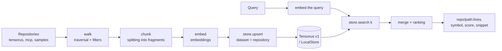

# WSIndex — Concept (One-Pager)

> **A record of intent, not of the current build.** This document says
> what was asked for when it was written. Much of it came true; the
> storage decision did not survive. **Tensorus v1 was replaced by
> LanceDB in ADR-7 (August 2026) and the code removed on 2026-08-21**, so
> every FR-4xx requirement, every REST endpoint and both backend names
> below describe a design that no longer exists. `LocalStore` is gone
> with it.
>
> Left standing rather than rewritten, and that is deliberate: threading
> the new decision through fourteen sections would turn a record of what
> was wanted into a claim about what is, and lose the ability to see what
> changed. What the system does today is in
> [README.md](../../README.md), which is measured and tested against the
> CLI; why the storage changed is in `../adr/adr-007-post-mvp-storage.md`.

## 1. The Problem: Why Searching Across Multiple Repositories Is Hard

Imagine a team that doesn't have just one project but a whole organization of repositories. Take a real example — the `tensorus` organization on GitHub: it hosts `tensorus`, `mcp`, `samples`, `datasets`, `models`, `tensorus-website` side by side, along with `v1`, `v1_web`, `v1_docs`. It's polyglot: code in Python, Rust, and TypeScript, configs (TOML/YAML/JSON, Dockerfile), documentation (Markdown, txt, rst, notebooks). Knowledge of "how things work" is smeared across dozens of places.

When a developer asks "where have we already implemented key-based authorization?", "where is the tensor format defined?", or "where is the service port configured?", ordinary search fails on several fronts at once:

- **Repository boundaries.** `grep` and IDE search work within a single project. But the answer often lives in another one: the API is called in `mcp` and `samples`, while the definition itself is in `tensorus`.
- **Search by letters, not by meaning.** Text search will find the word "token" but will miss `api_key`, `credential`, or a comment like "access key". What's needed is search by meaning, not by character match.
- **Heterogeneity of artifacts.** A Rust function, a key in `pyproject.toml`, a stage in a `Dockerfile`, and a paragraph in a README are structured in completely different ways. Slicing them "with a single knife" into lines or pages means losing structure and context.

The result: the knowledge exists, but it can't be found. A person spends time on archaeology, and an AI agent has no single entry point into the codebase at all.

## 2. The Solution Idea (in Two Paragraphs)

**WSIndex** (Workspace Indexer) is a Python CLI application that indexes a developer's entire workspace (to begin with — a collection of git repositories) into a single logical index and provides semantic search over it. You ask a question in natural language or directly with code — and get relevant fragments from several repositories at once: code, configs, documentation. In essence, it answers the questions "where is this already implemented", "where is it defined", and "where is it configured".

Everything runs **locally and self-hosted**: the repositories, the embedding model, and the database live on your machine, and the code never leaves it. WSIndex starts as a learning project — deliberately simple, readable, and pedagogical — but its architecture is laid out so it can grow into a full-fledged product: a unified "development space" with meaning-based search for people and agents.

## 3. How It Works, in Plain Terms

Indexing is a linear pipeline of several steps; search is its mirror image.

1. **Collect the files.** We walk the repositories, applying filters (skipping junk like build artifacts).
1. **Split into chunks.** Each file is divided into meaningful fragments — "chunks". Code and configs by structure, documents by text (more on this below).
1. **Compute the embeddings.** A local model (`sentence-transformers`) turns each chunk into a vector of numbers — "coordinates of meaning". The same model also embeds the search query.
1. **Store.** The vector is written to the database, and alongside it — the chunk's metadata (repository, path, language, symbol, lines). Each repository gets its own separate dataset.
1. **Search.** The query is also turned into a vector, the database finds the chunks closest in meaning within the relevant datasets, and the results are merged and ranked.
1. **Show.** The answer looks like `repo/path:lines, symbol, score, snippet` — immediately making clear where to go.

The CLI commands cover the whole cycle: `init`, `add-repo`, `index` (full and incremental), `search`, `status`.

## 4. Why Code and Configs Go Through AST, While Documents Are Treated as Text

The key intuition: **different artifacts have different "natural" units of meaning**.

For code, that unit is a function, a class, a method. That's why we parse code and configs through the AST (syntax tree, `tree-sitter`): for code, a chunk is an entire function or class; for configs, a structural node (a table in TOML, a key in YAML, a stage in a Dockerfile). This keeps the chunk whole and meaningful: searching for "the authorization function" makes more sense than "lines 40–55". As a bonus, the AST provides free metadata — the symbol name (`symbol`), the node type (`node_type`).

Documentation has a different nature: coherent text without rigid syntax. Splitting a README by "nodes" is pointless — there are no functions there. That's why Markdown, txt, rst, and the text cells of notebooks are chunked **as text**: by headings or with a sliding window with overlap, so a thought doesn't get cut off in the middle of a paragraph.

| Artifact type | Example from the corpus            | How we split      | Chunk unit                        |
| ------------- | ---------------------------------- | ----------------- | --------------------------------- |
| Code          | `tensorus`, `mcp` (Python/Rust/TS) | AST (tree-sitter) | function / class / method         |
| Configs       | `pyproject.toml`, `Dockerfile`     | AST by nodes      | table / key / stage               |
| Documentation | `v1_docs`, README                  | text              | by headings / window with overlap |

## 5. Why Tensorus v1 as the Database

> Superseded by ADR-7: the store is LanceDB, a file beside the
> config rather than a server to run. The reasoning below is kept
> because ADR-7's Context answers it point by point.

The index store is **Tensorus v1** (`github.com/tensorus/v1`), a tensor database with a REST API. The choice is not accidental and takes the hardest part off our shoulders.

- **No need to build an ANN index by hand.** Tensorus provides ready-made nearest-vector search on HNSW. We send `POST /datasets/{ds}/search/similar` with the body `{vector, k}` — and get back a list of hits (`tensor_id`, `score`).
- **A simple and predictable API.** The database is at `http://localhost:8080`, `Content-Type: application/json`, all values Float32. A dataset is created idempotently via `POST /datasets` with the body `{name, metric:"cosine"}`. A chunk's embedding is written as a tensor: `POST /datasets/{ds}/tensors` with `{data, shape:[dim], metadata:{...}}`, and the chunk's metadata is placed in the `metadata` field.
- **Thematic fit.** Storing vectors in a tensor database is conceptually "on topic"; and at the growth stage its own `/search/property` and `/search/contraction` will come in handy.

An important nuance we account for up front: `property-search` filters by the **mathematical** properties of a tensor (norm, rank, symmetry), not by our `metadata`. That's why we do repository isolation architecturally — **one dataset per repository** — plus a client-side post-filter by metadata.

Separately — on portability. The entire store is hidden behind the `VectorStore` abstraction (the `create/upsert/search` interface) with two implementations: the primary one — `TensorusStore` (REST to v1); the fallback — `LocalStore` (brute-force cosine on numpy, stored in local files). `LocalStore` lets the project work even without a running Rust server, which matters for learning and testing.

## 6. What's In the MVP and What's Not Yet

| In the MVP (doing now)                                                  | Out of MVP (roadmap)                        |
| ----------------------------------------------------------------------- | ------------------------------------------- |
| Indexing multiple repositories into a single index                      | Tensor re-rank / late interaction (MaxSim)  |
| AST chunking of code and configs, text for docs                         | Development-space graph (issues/PR/commits) |
| Local embeddings (`sentence-transformers`)                              | Incremental updates via git-diff (E2)       |
| Storage: `TensorusStore` + `LocalStore`                                 | Distribution, sharding, cloud               |
| Single-vector search (one vector per chunk)                             | IDE plugin, moving hot paths to Rust        |
| CLI: `init`, `add-repo`, `index`, `search`, `status`                    |                                             |
| Incremental `index`: skipping chunks by matching `id` (priority Should) |                                             |

**On incremental updates — to avoid conflating two different meanings.** In the MVP, "incremental" reindexing is simply skipping chunks whose `id` (hash of content + path) is already indexed; priority — Should. Smarter incremental updates via `git diff` (reindexing only changed files) are already E2, and they sit in "Out of MVP".

**On idempotency — honestly about the API's limitation.** The listed Tensorus endpoints only allow creating a tensor (`POST /tensors`), with no upsert-by-id and no deletion. That's why we ensure reindexing determinism through deterministic `id`s: an incremental run skips already-known `id`s, while a full reindex recreates the repository's dataset from scratch. Strict upsert without duplicates on the v1 side is an open integration question, not an MVP promise.

Honestly about scale: this is a learning project. Simplicity and readability matter more than performance; the goal is adequate operation on tens of thousands of chunks, not millions.

## 7. Value: For the Developer and the AI Agent

**For the developer**, WSIndex saves time on "where is this already implemented". Instead of walking through ten repositories by hand — a single question and an answer like `mcp/client.py:42, call_api, 0.87`. Onboarding into an unfamiliar codebase speeds up: you can ask by meaning rather than guessing the words.

**For the AI agent**, WSIndex provides a single entry point into the code — a tool that, on request, returns precise fragments from across the entire workspace. The agent stops "hallucinating" about the project's structure and works with real snippets. A telling cross-repo scenario (a growth goal): "where is the `tensorus` API called and what will break if the signature changes" — it links `mcp` and `samples` with the definition in `tensorus`.

## 8. Vision for Growing Into a Product

- **E1 — MVP:** single-vector, AST for code/configs, text for docs, multi-repo, Tensorus and Local backends, CLI.
- **E2:** structural metadata from the AST (`node_type`, `pub`/`async`, decorators) as search filters; incremental reindexing via git-diff.
- **E3:** tensor re-rank — a custom MaxSim or Tensorus's `/search/contraction`.
- **E4:** development space — docs/ADR/issue/PR as sources, a cross-repo symbol graph.
- **E5:** performance and scale — moving hot paths to Rust.
